# ESPHome Puerta + Timbre — Definición del Sistema

Sistema autónomo para control de acceso de puerta con timbre musical,
apertura temporizada, señalización visual y audible, y corte de
emergencia físico. Basado en NodeMCU ESP8266 con ESPHome, sin
dependencia de Home Assistant ni MQTT. Todo el cableado entre zonas
sobre un solo UTP Cat5 de 4 pares, sin cables adicionales.

## 1. Resumen de Hardware

| Emoji | Componente | Propósito |
|-------|-----------|-----------|
| 🧠 | NodeMCU ESP8266 | Microcontrolador ejecutando ESPHome |
| ⚡ | Fuente 5V | Alimentación NodeMCU (local en vestíbulo) |
| ⚡🔒 | Fuente 12V | Alimentación cerradura + LEDs (local en vestíbulo) |
| 🔒 | Relé | Conmuta 12V de la cerradura (NC = cerrada) |
| 🔒 | Cerradura Magnética | Mantiene la puerta cerrada mientras recibe 12V |
| 🔊 | Buzzer Musical (RTTTL) | Zumbador piezoeléctrico — melodía y pitidos. ×3 unidades (salón con pot. volumen serie) |
| 🔹 | Pulsadores Internos (×2) | Salón y vestíbulo — GPIO4 en paralelo |
| 🔸 | Pulsadores Externos (×2) | Patio y exterior — GPIO16 en paralelo |
| 💡 | LEDs Estado | Tiras LED 12V internas (salón, vestíbulo) + LED 3V externos (patio, exterior) |
| 🔹💡 | Transistor NPN 2N5551 (×2) | Paneles internos — conmutan 12V a tira LED desde GPIO12 |
| 🚪 | Final de Carrera (NA) | GPIO13 — detecta puerta abierta/cerrada |
| 🚫 | Pedal de Emergencia | Corte físico NC en serie con 12V de la cerradura |

## 2. Lista de Materiales

| Componente | Cant. | Precio Unit. | Subtotal | Especificación |
|-----------|:-----:|:-----------:|:--------:|----------------|
| [NodeMCU ESP8266](https://tienda.lega.ar/producto/esp8266-lua-wifi-v3-ch340-para-nodemcu) | 1 | $11.106,90 | $11.106,90 ✅ | ESP-12E, CP2102, microUSB |
| Fuente 5V | 1 | $9.315,95 | $9.315,95 | 5V DC, ≥1A, tipo cargador USB |
| [Fuente 12V](https://tienda.lega.ar/producto/fu12v2000-fuente-switching-12-v-2-a-) | 1 | $13.349,35 | $13.349,35 | 12V DC, ≥2A, tipo brick |
| [Relé 5V módulo simple inversor](https://tienda.lega.ar/producto/30rl11g1-modulo-1-relay-rele-5v-simple-inv) | 1 | $2.016,70 | $2.016,70 | Módulo relé 1 canal, 5V bobina, 10A/250V contacto, NC/NA/COM |
| [Cerradura Magnética](https://tienda.lega.ar/producto/em300-cerradura-electromagnetica) | 1 | $69.786,85 | $69.786,85 ✅ | 12V, tipo ML-1501 o similar, ≤1.5A |
| [Final de Carrera](https://tienda.lega.ar/producto/mcw1-microswitch-mcw1-22mmx10mm-crueda) | 1 | $1.730,75 | $1.730,75 | NA, microswitch con rodillo |
| Pedal de Emergencia | 1 | — | — ✅ | Fabricado con pulsador NA (usar existente) |
| [Buzzer 12V miniatura](https://tienda.lega.ar/producto/buz12-buzzer-miniatura-12v) | 3 | $1.143,80 | $3.431,40 | Buzzer piezoeléctrico 12V, 20mm |
| [Pulsador NA (interno)](https://tienda.lega.ar/producto/pls930--pulsador-cuadrado-na) | 2 | $466,55 | $933,10 ✅ | Pulsador momentáneo NA, tipo campana |
| [Pulsador NA (externo)](https://tienda.lega.ar/producto/pfpsz-pulsador-frente-portero-l-nueva) | 2 | $6.742,40 | $13.484,80 ✅ | Pulsador frente portero, estanco IP54, timbre exterior |
| [LED 5mm Azul Extra Alta](https://tienda.lega.ar/producto/led-5-mm-azul-extra-alta-ef-ea5az) | 2 | $406,35 | $812,70 | 5mm azul, extra alta luminosidad, patios y exterior |
| Tira LED 12V (internos) | 2 | — | — ✅ | RGB o blanco, ~30cm, con resistor serie incorporado |
| [Transistor NPN 2N5551](https://tienda.lega.ar/producto/2n5551-transistor-npn-160v-600-ma-625mw) | 5 | $165,55 | $827,75 | TO-92, 160V/600mA (2 LED + 3 buzzer) |
| [Resistencia 1kΩ](https://tienda.lega.ar/producto/res0251k-resistencia-025-w-1k-ohms) | 5 | $165,55 | $827,75 | 1/4W, carbon film (base 2N5551) |
| Resistencia 150Ω | 2 | $165,55 | $331,10 | 1/4W, carbon film (LED 3.3V serie) |
| Resistencia 10kΩ | 1 | $165,55 | $165,55 | 1/4W, carbon film (pull-up GPIO16) |
| [Potenciómetro 10kΩ](https://tienda.lega.ar/producto/pot710k-potenciometro---lineal-mignon-eje-grueso-10k-ohm) | 1 | $2.091,95 | $2.091,95 | Lineal, reóstato, 6mm |
| [Cable UTP Cat5 (x 1m)](https://tienda.lega.ar/producto/cable-utp-interior-cat5-x-metro-5e100-) | 1 | $406,35 | $406,35 ✅ | 4 pares, sólido, CCA o cobre |
| [Placa perforada 50×50mm](https://tienda.lega.ar/producto/50x50--plaqueta-simple-faz-50x50-fenolico) | 1 | $918,05 | $918,05 | 7×5 cm o similar |
| [Cables dupont H-H 40P 20cm](https://tienda.lega.ar/producto/chh20-cable-dupont-hembra-hembra-40p-20-cm-) | — | $2.648,80 | $2.648,80 ✅ | Varios, 22AWG |
| **Total general** | | | **$127.443,40** | (20 cotizados, todos cubiertos) |
| **Subtotal a comprar** | | | **$35.819,00** | (excluye ✅) |

## Distribución Física

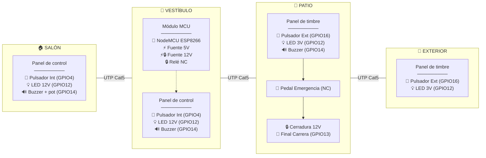

## Cableado (UTP Cat5, 4 pares)

| Par | Hilo | Señal | Emoji | Destino | Grupo |
|-----|------|-------|-------|---------|-------|
| 1 | BL | GPIO4 (pulsador interno) | 🔹 | Salón | Entradas |
| 1 | NA | GPIO16 (pulsador externo) | 🔸 | Patio + Ext. | Entradas |
| 2 | BL/V | GPIO13 (final carrera) | 🚪 | Patio | Patio |
| 2 | V | Cerradura 12V (vía relé NC) | 🔒 | Patio | Patio |
| 3 | BL/AZ | GPIO14 (buzzer musical) | 🔊 | Salón + Vest. + Patio | Audio |
| 3 | AZ | GPIO12 (PWM LEDs) | 💡 | Todas | Broadcast |
| 4 | BL/MR | **GND común** | ⬛ | Todas | Power |
| 4 | MR | **12V siempre vivo** | ⚡ | Todas | Power |

- Par 1 = botones, par 2 = patio (FC + cerradura), par 3 = audio (BL/AZ) + broadcast LED (AZ), par 4 = alimentación
- Los paneles de salón, vestíbulo y patio llevan buzzer (GPIO14 por par 3 BL/AZ → 2N5551 → BUZ12 12V). El de salón adicionalmente tiene un potenciómetro de 10kΩ como divisor en la base del 2N5551 para ajuste local de volumen. El exterior no lleva buzzer.
- 12V viaja por par 4 MR junto con GND (par 4 BL/MR) — mejor para la fuente
- Relé NC en vestíbulo conmuta 12V desde par 4 MR hacia par 2 V → cerradura en patio
- Cada panel solo pela los pares que necesita (ej. exterior solo pares 1, 3 AZ, 4 — sin BL/AZ)

## 3. Asignación de Pines

| GPIO | Emoji | Componente | Tipo |
|------|-------|-----------|------|
| GPIO4 | 🔹 | Pulsadores internos (salón + vestíbulo, paralelo) | Entrada (pull-up, invertido) |
| GPIO16 | 🔸 | Pulsadores externos (patio + exterior, paralelo) | Entrada (pull-up ext.) |
| GPIO12 | 💡 | PWM LEDs — señal común a todas las zonas | Salida (PWM) |
| GPIO14 | 🔊 | Buzzer Musical (×3: salón, vestíbulo, patio; salón con pot. serie) | Salida (PWM 2000 Hz, RTTTL) |
| GPIO5 | 🔒 | Relé de Cerradura (NC → lock, NA → libre) | Salida (relé) |
| GPIO13 | 🚪 | Final de Carrera + detección emergencia | Entrada (pull-up, NA) |

## 4. Definición de Componentes

### 4.1 Pulsadores Internos (panel de control)
- **Pin**: GPIO4, `INPUT_PULLUP`, invertido. Paralelo salón + vestíbulo.
- **Pulsación corta** (< 4s): ejecuta `internal_press` (solo en ACTIVADO)
- **Pulsación larga** (> 4s): si sistema DESACTIVADO → `enable_system`
- **Pulsación muy larga** (> 8s): si sistema ACTIVADO → `disable_system`

### 4.2 Pulsadores Externos (panel de timbre)
- **Pin**: GPIO16, `INPUT` con pull-up ext. 10kΩ. Paralelo patio + exterior.
- **Pulsación corta** (< 4s): ejecuta `external_press` (solo timbre, NO desbloquea)
- Pulsaciones largas ignoradas (solo el panel de control interno tiene función de mantenimiento)

### 4.3 Relé
- GPIO5. **ID**: `lock_relay`
- **OFF** → NC cerrado → cerradura recibe 12V → puerta cerrada
- **ON** → NC abierto → cerradura pierde 12V → puerta desbloqueada
- NA no se usa

### 4.4 Final de Carrera
- GPIO13. INPUT_PULLUP. NA a GND.
- **ON**: puerta abierta. **OFF**: puerta cerrada.
- Si se activa con relé OFF → apertura por emergencia
- **Al cerrar la puerta** (FC → OFF): si el LED está en flash lento (estado puerta abierta), vuelve a 25% reposo. No afecta al cooldown externo.

### 4.5 Buzzer Musical (RTTTL)
- GPIO14 (PWM) → 1kΩ → 2N5551 base. El transistor conmuta 12V (Par 4 MR) hacia Par 3 BL/AZ.
- Los paneles de salón, vestíbulo y patio tienen su propio 2N5551 local que recibe la señal de BL/AZ y conmuta 12V al BUZ12 (el exterior no lleva buzzer).
- En cada panel, entre 12V y el buzzer hay un placeholder para resistencia de atenuación (0Ω = cable directo por ahora):
```
                 ┌─── R_atenuación (0Ω placeholder) ─── BUZ12(+) ── BUZ12(−)
Par 3 BL/AZ ──┤1kΩ├── base 2N5551                   └─── colector 2N5551
                                                emisor 2N5551 ── GND
```
- El panel de salón adicionalmente tiene un potenciómetro de 10kΩ en serie entre BL/AZ y la base del 2N5551 (divisor de tensión) para ajuste local de volumen.
- Si a futuro el volumen es muy intenso, se reemplaza el cable por una resistencia (ej. 470Ω) en cada panel.

Todos los sonidos del sistema usan RTTTL (definidos en `melodies.h`):
  - `ALL_MELODIES[]`: 4 melodías de timbre
  - `APERTURA`: sonido de desbloqueo
  - `EMERGENCIA`: alarma de emergencia
  - `ACTIVAR` / `DESACTIVAR`: activación/desactivación del sistema
  - `BEEP_FLASH`: pitido corto del flash de puerta abierta
- Cada pulsación del timbre (externo) reproduce la siguiente melodía RTTTL en secuencia.
- Al terminar el cooldown del desbloqueo interno (doorbell_led_duration), si la puerta sigue abierta (FC=ON), el índice se resetea a la melodía 1.
- Durante el desbloqueo suena el sonido RTTTL de apertura, no melodía.
- La alarma de emergencia usa RTTTL.

### 4.6 LEDs Estado
- GPIO12 PWM → UTP par 3 AZ. Señal común a las 4 zonas.
- Cada panel tiene su propia conversión local:

**Paneles internos (salón, vestíbulo)** — Tira LED 12V transistorizada:
```
UTP par 3 AZ ──┤1kΩ├── base 2N5551
UTP par 4 MR (12V) ── tira LED (+) ── tira LED (−) ── colector
UTP par 4 BL/MR (GND) ── emisor
```
(La tira LED incluye resistor limitador serie incorporado.)

**Paneles externos (patio, exterior)** — LED directo:
```
UTP par 3 AZ ──┤150Ω├─── LED ─── UTP par 4 BL/MR (GND)
```
(GPIO12 conmuta 3.3V PWM directamente al LED vía resistencia limitadora.)

- PWM desde GPIO12 controla todo, los cuatro LEDs reciben el mismo brillo.
- **Efectos:**
  - *Latido suave*: oscilación 50%–100% con transición de 1s
  - *Flash rápido*: 200ms ON / 200ms OFF
  - *Flash lento*: duración configurable (`gate_open_flash_interval`), acompañado de pitido corto

## 5. Estado del Sistema

El sistema tiene dos estados:

| Estado | Relé | Pulsadores | LED | Uso |
|--------|------|-----------|-----|-----|
| **DESACTIVADO** (boot) | ON (puerta desbloqueada) | Ignorados | OFF | Mantenimiento / emergencia |
| **ACTIVADO** | Según `unlock_gate` | Operación normal | 25% brillo (reposo) | Uso diario |

Transiciones:
- Boot → DESACTIVADO
- DESACTIVADO + pulsación interna >4s → ACTIVADO
- ACTIVADO + pulsación interna >8s → DESACTIVADO

## 6. Detección de Emergencia

```
Al recibir final carrera = ON:
  Si desbloqueo_normal_activo OR lock_relay está ON
     → desbloqueo normal (relé OFF)
  Si no
     → apertura no autorizada (pedal/forzada) → emergency_alert
```

El flag `desbloqueo_normal_activo` se pone a true al iniciar `unlock_gate`
y se limpia al terminar. Así un FC ON que llegue justo después de apagar
el relé no se confunde con emergencia.

## 7. Comportamiento

| Evento | 🔒 Relé | 🔊 Buzzer | 💡 LED |
|--------|:------:|:--------:|:-----:|
| **Sistema DESACTIVADO** | ON (perm.) | — | OFF |
| **Sistema ACTIVADO** (reposo) | — | — | 25% |
| 🔹 >4s (DESACT → ACTIVAR) | OFF | Secuencia activación | 3 flashes → 25% |
| 🔹 >8s (ACTIV → DESACTIVAR) | ON (perm.) | Secuencia desactivación | 3 flashes → OFF |
| 🔸 Externo (ACTIVADO) | — | Melodía actual | Latido 100% `doorbell_led_duration` |
| 🔹 Interno (ACTIVADO) | ON `unlock_duration` | RTTTL Apertura | Flash rápido |
| 🚪 Abierta tras desbloqueo | OFF | Pitido c/flash | Flash lento `gate_open_flash_interval` |
| 🚪 Cerrada tras desbloqueo | OFF | — | 25% |
| 🚪 FC → OFF (cierra) | — | — | Si estaba en flash lento → 25% |
| 🚨 Emergencia (🚪ON + 🔒OFF) | — | RTTTL Emergencia (×4) | LED sincronizado 1067ms ON / 133ms OFF |

Mientras el sistema está DESACTIVADO el relé permanece ON y cualquier pulsación (externa o interna) es ignorada.
Los pulsadores externos **nunca desbloquean** la puerta — solo tocan el timbre.
El cooldown del pulsador externo es independiente del interno (cada uno con su bandera).
Al cerrar la puerta (FC→OFF) el LED vuelve a 25% si estaba en flash lento.

## 8. Scripts

### 8.1 `external_press` (patio / exterior — timbre)
```
1. Si sistema DESACTIVADO → salir
2. Si cooldown_externo_activo → salir (ignorar)
3. cooldown_externo_activo = true
4. Cancelar timer_reset_melodia (si existe)
5. Reproducir melodía actual (RTTTL, no bloqueante)
6. LED → LATIDO SUAVE al 100%
7. Esperar doorbell_led_duration
8. LED → 25% (reposo)
9. cooldown_externo_activo = false
10. índice de melodía + 1
11. Iniciar timer_reset_melodia (60s)
```

El cooldown usa una bandera propia (`cooldown_externo_activo`), no el
estado del LED. Así el externo y el interno son completamente independientes.

Si transcurren 60s sin una nueva pulsación externa, el timer resetea
el índice de melodía a 0. Si ocurre una nueva pulsación antes, el
timer se cancela (paso 4) y se reinicia al final del cooldown (paso 11).

### 8.2 `internal_press` (salón / vestíbulo — abrir puerta)
```
1. Si sistema DESACTIVADO → salir
2. LED → Flash rápido
3. Ejecutar unlock_gate
4. Esperar doorbell_led_duration  (tiempo de bloqueo para nueva apertura)
5.    Si final carrera = ON → LED → flash lento + pitido corto (gate_open_flash_interval)
                            índice de melodía → 0 (reseta playlist)
   Si no → LED → 25% (reposo)
```

El interno no reproduce melodía, no avanza el índice de melodía,
y no comparte cooldown con el externo — son independientes.

### 8.3 `unlock_gate`
```
1. desbloqueo_normal_activo = true
2. Relé → ON. Detener RTTTL anterior.
3. Bucle hasta unlock_duration:
   a. Reproducir sonido de apertura (RTTTL APERTURA)
   b. LED sincronizado: 67ms ON / 67ms OFF (sigue patrón c,p)
   c. Verificar FC cada 10ms:
      - FC se abre (puerta abierta):
        * Arranca grace timer (unlock_grace_ms, default 2s)
        * Durante grace: melodía sigue sonando
        * Grace expira → detener RTTTL, buzzer OFF, relay sigue ON
        * FC se cierra (puerta cerrada) → Relay → OFF. Return inmediato.
      - FC nunca se abre → timeout normal.
4. Timeout:
   - Si FC = ON (puerta cerrada) O Safe Lock = OFF → Relé → OFF
   - Si Safe Lock = ON + puerta abierta → relay queda ON, FC on_press auto-lock
5. Detener RTTTL. Apagar buzzer.
6. LED → 25% (reposo, transición 1s)
7. desbloqueo_normal_activo = false
```

> Durante el desbloqueo el LED sigue el ritmo de la melodía APERTURA. El Safe Lock (toggle vía web) evita que el lock se energice con la puerta abierta. Al cerrar la puerta, el FC on_press ejecuta auto-lock si relay está aún ON.

### 8.4 `flash_and_beep`
Reproduce el sonido de **apertura** (RTTTL) en bucle durante el desbloqueo:

```
d=16,o=7,b=225:c,p,c,p,...  (pitidos rápidos, se repite hasta que finalice el desbloqueo)
```

El sonido se inicia al activar el relé y se reproduce hasta que:
- La puerta se abre: sigue sonando `unlock_grace_ms` (default 2s), luego silencio.
- El FC detecta cierre de puerta: fin inmediato, relay → OFF.
- Expira `unlock_duration`: fin forzado.

El LED parpadea sincronizado: 67ms ON (nota) / 67ms OFF (silencio). Tras el desbloqueo, el LED vuelve a 25% y `internal_press` gestiona el estado final.

### 8.5 `enable_system`
```
1. Sistema → ACTIVADO
2. Reproducir arpegio ascendente (RTTTL ACTIVAR)
   d=4,o=5,b=320:c,16p,e,16p,g,16p,c6
3. LED: 4 flashes sincronizados (190ms on / 45ms off) → 25% (reposo)
4. Relé → OFF (cerradura bloqueada)
```

### 8.6 `disable_system`
```
1. Sistema → DESACTIVADO
2. Reproducir arpegio descendente (RTTTL DESACTIVAR)
   d=4,o=5,b=320:c6,16p,g,16p,e,16p,c
3. LED: 4 flashes sincronizados (190ms on / 45ms off) → OFF
4. Relé → ON permanentemente (cerradura desbloqueada)
```

### 8.7 `emergency_alert`
```
1. Alarma de emergencia (RTTTL): se repite en bucle hasta 60s
   d=1,o=6,b=225:c,8p,c,8p,c,8p,c,8p  (~4.8s cada ciclo)
2. LED sincronizado: 1067ms ON / 133ms OFF (sigue patrón c,8p)
3. El bucle se corta si:
   - Se presiona el pulsador interno (→ unlock_gate)
   - La puerta se cierra (FC → OFF)
4. Al terminar (bucle completo o corte):
   Si sigue abierta → flash lento + pitido (gate_open_flash_interval)
   Si no → LED → 25% (reposo), silencio
```

## 9. Comunicación

| Método | Propósito |
|--------|-----------|
| WiFi | Red local + AP respaldo |
| Web Server | http://<ip>/ — control manual |
| OTA | Actualizaciones |

Sin HA, API nativa ni MQTT.

## 10. Parámetros

| Parámetro | Default | Configurable | Descripción |
|-----------|---------|-------------|-------------|
| `unlock_duration` | 5s | No | Tiempo que la cerradura permanece desbloqueada |
| `doorbell_led_duration` | 45s | Web (10–120s) | Duración del latido suave del LED al pulsar timbre |
| `gate_open_flash_interval` | 5s | Web (1–30s) | Intervalo de flasheo del LED cuando puerta está abierta |
| `melody_reset_timeout` | 60s | No | Tiempo sin pulsaciones externas tras el cooldown que resetea el índice de melodía a 0 |

## 11. Repertorio de Melodías (RTTTL)

4 melodías en formato RTTTL. Cada pulsación del timbre externo
reproduce la siguiente. Al llegar a la cuarta vuelve a la primera.
El ciclo se resetea a la melodía 1 al terminar el cooldown del
desbloqueo interno si la puerta sigue abierta (FC=ON).

| # | Código RTTTL |
|---|--------------|
| 1 | `d=8,o=6,b=140:c,c,g,4g,16g,16p,f,g,c,2c,p` |
| 2 | `d=8,o=6,b=140:c,g,c7,4c7,16c7,16p,b,c7,g,2g,p` |
| 3 | `d=4,o=4,b=100:c7,b,2a,16a,16p,a,d7,b,2g,p` |
| 4 | `d=4,o=4,b=100:a,b,c7,g,f,e,g,4d,16d,16p,c,2c,p` |
| Apertura | `d=16,o=7,b=225:c,p,c,p,c,p,c,p,c,p,c,p,c,p,c,p,c,p,c,p,c,p,c,p,c,p,c,p,c,p,c,p,c,p,c,p,c,p,c,p,c,p,c,p,c,p,c,p,c,p,c,p,c,p,c,p,c,p,c,p,c,p,c`|
| Emergencia | `d=1,o=6,b=225:c,8p,c,8p,c,8p,c,8p` |
| ACTIVAR | `d=8,o=5,b=200:8c,8e,8g,8c6,8e6,8d6,8c6,4g` |
| DESACTIVAR | `d=8,o=5,b=200:8c6,8g,8e,8c,8a4,8g,8e,4c` |
| BEEP_FLASH | `d=8,o=5,b=300:b` |

Las cadenas se definen en `melodies.h` como `static const char[] PROGMEM` para ahorrar RAM en el ESP8266.

## 12. Diagramas

### 12.1 Máquina de estados del sistema

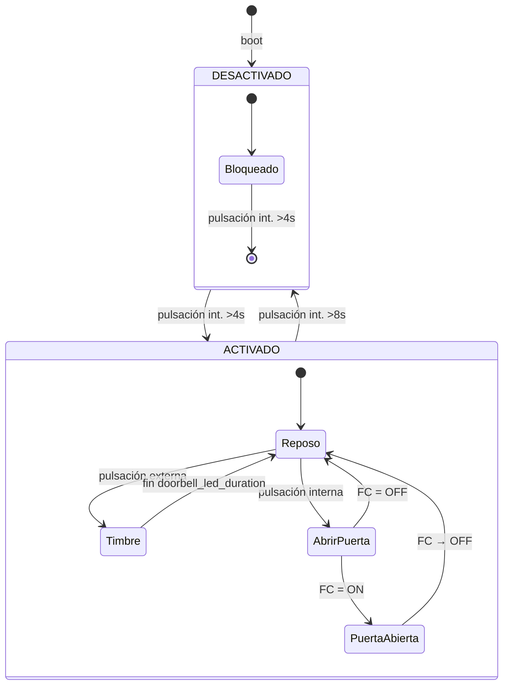

### 12.2 Diagrama general de conexiones (Vestíbulo)

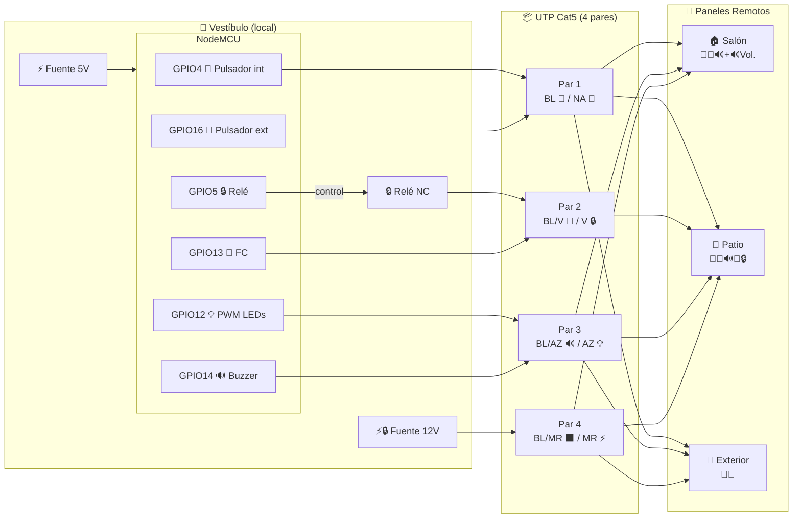

### 12.3 Circuito — Panel Interno (salón / vestíbulo)

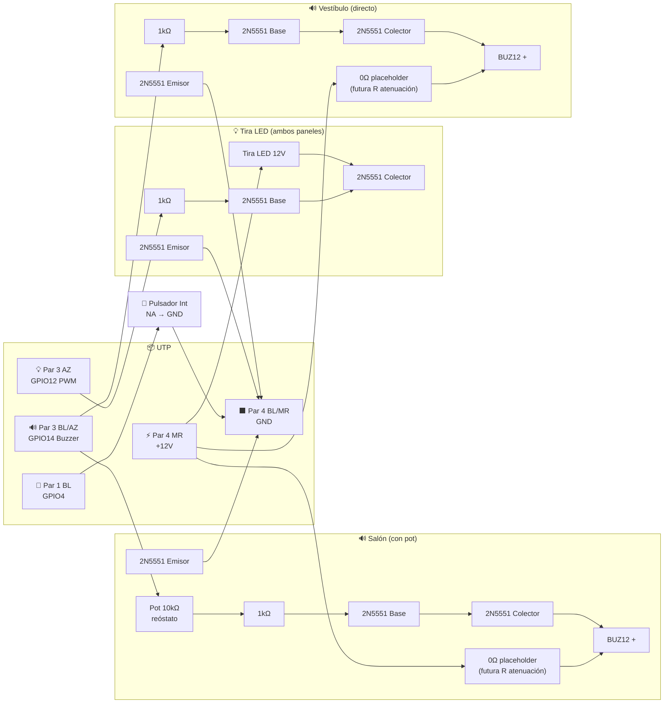

> **Panel de salón**: el buzzer lleva potenciómetro de 10kΩ entre BL/AZ y la base del 2N5551 como divisor de volumen. Entre 12V y el BUZ12 hay un placeholder para resistencia de atenuación futura (0Ω = cable directo).
> **Panel de vestíbulo**: sin potenciómetro, el 1kΩ va directo de BL/AZ a la base.
> Ambos paneles comparten el mismo circuito de LED (2N5551 + tira LED 12V).

### 12.4 Circuito — Panel Externo (patio)

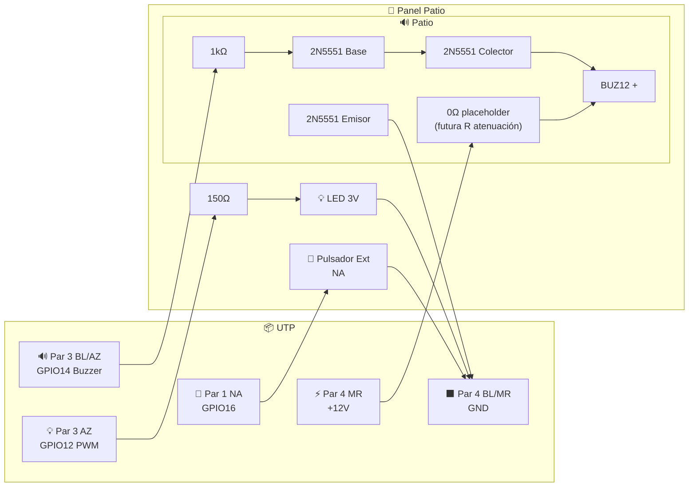

> El panel **exterior** es idéntico pero **sin el buzzer** — no conecta el hilo BL/AZ del par 3. Solo lleva pulsador (par 1 NA), LED (par 3 AZ) y alimentación (par 4).
> El pull-up de 10kΩ a 3.3V para GPIO16 está en el **vestíbulo**, junto al MCU.
### 12.5 Circuito — Cerradura + Pedal de Emergencia

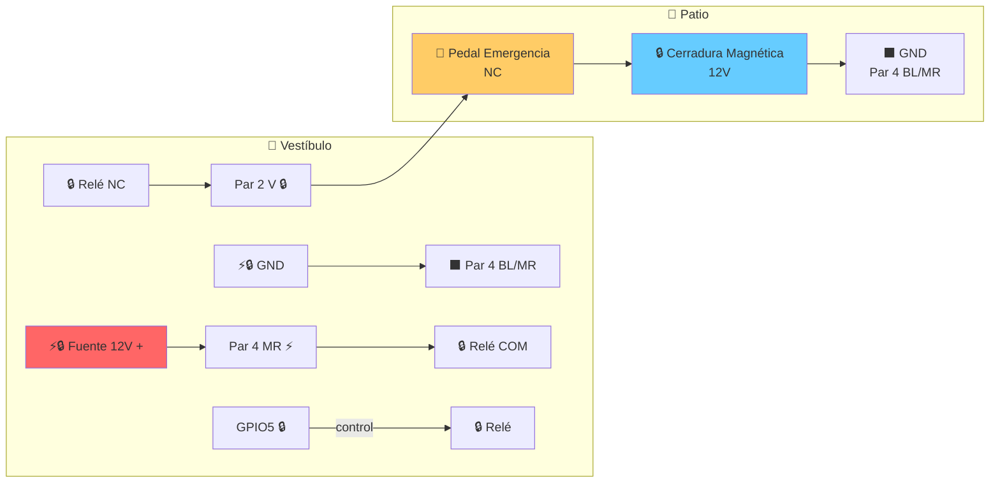

Flujo: `+12V → Par 4 MR → Relé COM → NC → Par 2 V → Pedal NC → Cerradura → GND`

| 🔒 Relé NC | 🚫 Pedal NC | 🔒 Cerradura |
|:----------:|:----------:|:------------:|
| Cerrado (OFF) | Cerrado | ⚡ 12V → puerta cerrada |
| Cerrado (OFF) | Abierto | ⬛ 0V → apertura emergencia |
| Abierto (ON) | — | ⬛ 0V → desbloqueo normal |

> **Safe Lock** (configurable vía web): cuando está activo, el lock solo se energiza si el FC indica puerta cerrada. Si al terminar el timeout de apertura la puerta sigue abierta, el relé queda ON (lock sin poder) hasta que el FC detecte el cierre → auto-lock inmediato. Esto evita dejar el imán activo con la puerta abierta. Toggle en `http://<esp>/switches`.
>
> **Grace Duration** (configurable vía web, por defecto 2s): tiempo que sigue sonando la melodía después de que el FC detecta que la puerta se abrió. Pasado ese lapso se apaga el buzzer aunque el relay siga ON esperando el cierre. Ajustable en `http://<esp>/numbers`.

### 12.6 Pull-up de pulsador externo (GPIO16)

El pull-up de 10kΩ para GPIO16 está en el **vestíbulo**, junto al MCU. No en los paneles remotos.

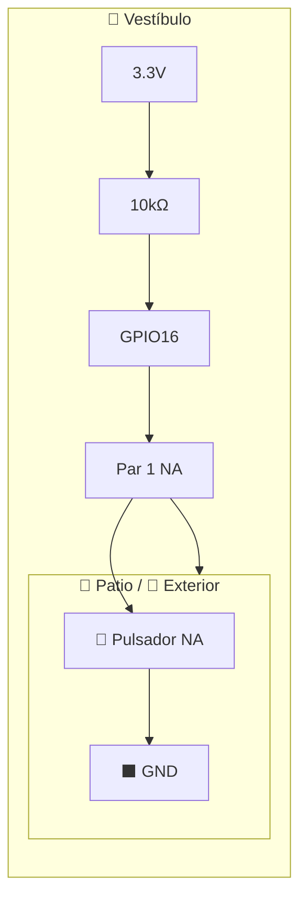

### 12.7 Swimlane — `external_press`

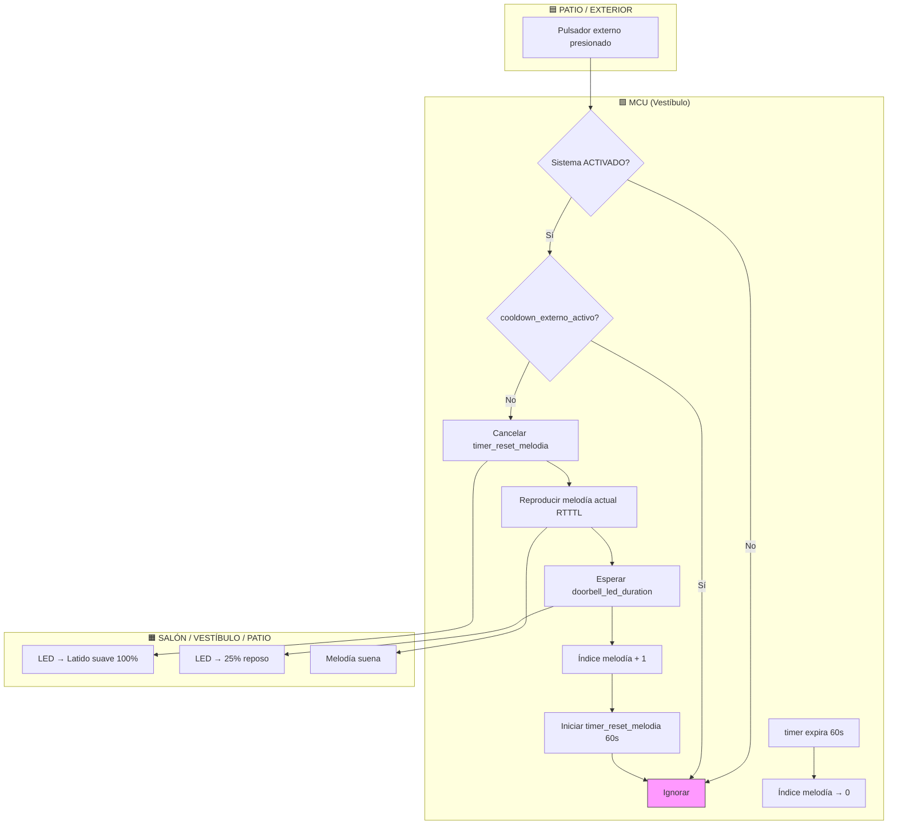

### 12.8 Swimlane — `internal_press`

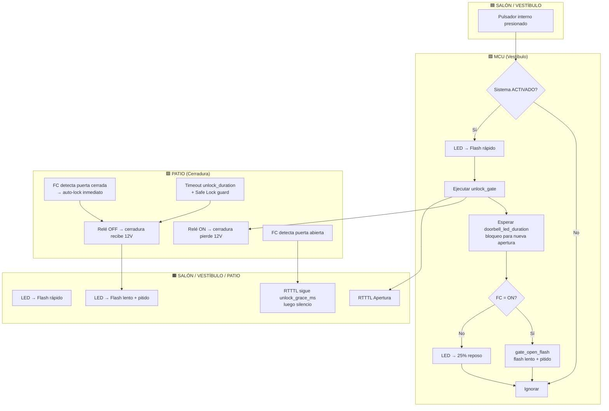

### 12.9 Swimlane — `unlock_gate`

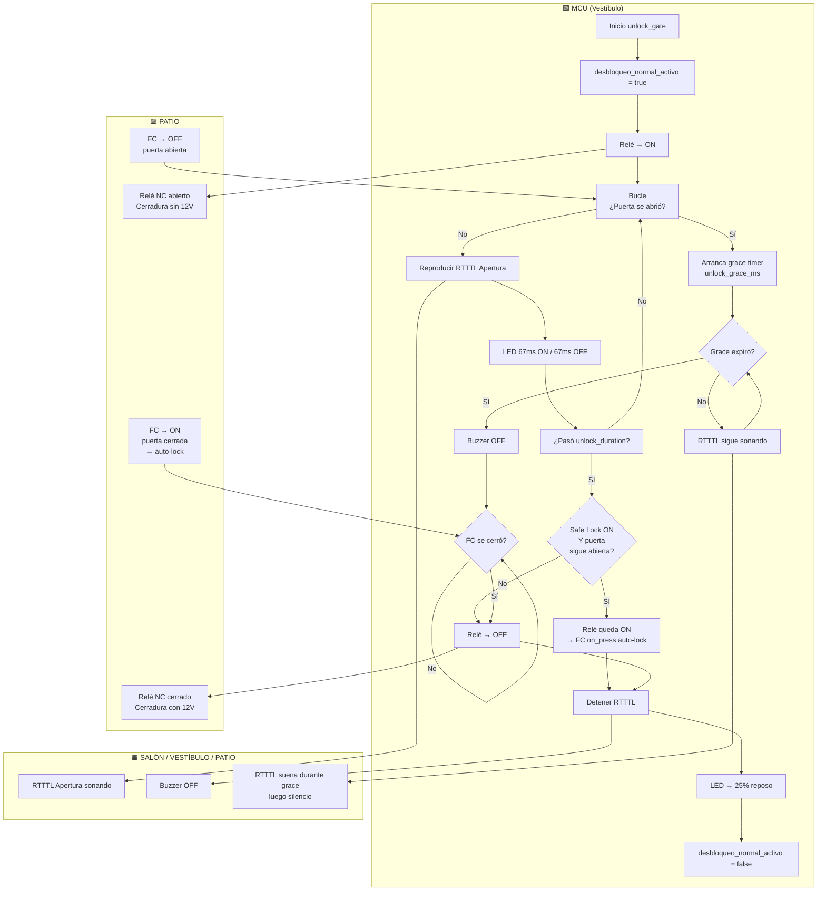

### 12.10 Swimlane — Detección de emergencia

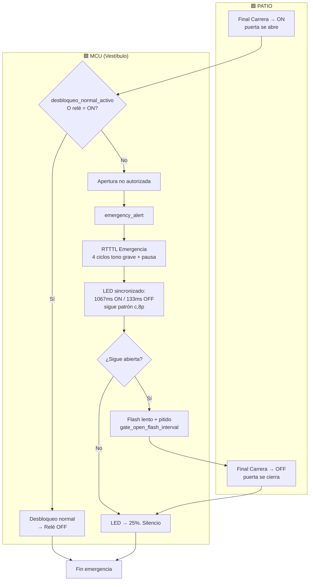

> Si **Safe Lock** está activo y el relé quedó ON (lock sin poder, puerta abierta), al abrirse la puerta `EVT → relé = ON → NORMAL` → no hay emergencia. El auto-lock ocurre silenciosamente cuando el FC detecta el cierre (`on_press`).

## 13. Archivos

```
esphome-gate/
├── SYSTEM_DEFINITION.md   # Especificación completa del sistema
├── esphome-gate.yaml      # Configuración ESPHome
├── melodies.h             # Definiciones RTTTL (referencia)
└── secrets.yaml           # Credenciales WiFi (editar antes de compilar)
```

