# ESPHome Puerta + Timbre — Definición del Sistema

Sistema autónomo para control de acceso de puerta con timbre musical,
apertura temporizada, señalización visual y audible, y corte de
emergencia físico. Basado en NodeMCU ESP8266 con ESPHome, sin
dependencia de Home Assistant ni MQTT. Todo el cableado entre zonas
sobre dos UTPs Cat5 de 4 pares: uno para interior (salón) y otro para
exterior (patio), sin cables adicionales.

## 1. Resumen de Hardware

| Emoji | Componente | Propósito |
|-------|-----------|-----------|
| 🧠 | NodeMCU ESP8266 | Microcontrolador ejecutando ESPHome |
| ⚡ | Fuente 5V | Alimentación NodeMCU (local en vestíbulo) |
| ⚡🔒 | Fuente 12V | Alimentación cerradura + LEDs (local en vestíbulo) |
| 🔒 | Relé | Conmuta GND de la cerradura (NC = cerrada) |
| 🔒 | Cerradura Magnética | Mantiene la puerta cerrada mientras recibe 12V |
| 🔊 | Buzzer Musical (RTTTL) | Zumbador piezoeléctrico — melodía y pitidos. ×3 unidades (salón con pot. volumen serie) |
| 🔹 | Pulsadores Internos (×2) | Salón y vestíbulo — GPIO4 en paralelo |
| 🔸 | Pulsadores Externos (×2) | Patio y exterior — GPIO16 en paralelo |
| 💡 | LEDs Estado | Tiras LED 12V internas (salón, vestíbulo) + LED 12V externos (patio, exterior, vía 2N5551) |
| 🔹💡 | Transistor NPN 2N5551 (×6) | 3 para LED (2 tiras internas + 1 externos) + 3 para buzzer |
| 🚪 | Final de Carrera (NA) | GPIO13 — detecta puerta abierta/cerrada |
| 🚫 | Pedal de Emergencia | Corte físico NC en serie con 12V de la cerradura |

## 2. Lista de Materiales

| Componente | Cant. | Precio Unit. | Subtotal | Especificación |
|-----------|:-----:|:-----------:|:--------:|----------------|
| [NodeMCU ESP8266](https://tienda.lega.ar/producto/esp8266-lua-wifi-v3-ch340-para-nodemcu) | 1 | $11.106,90 | $11.106,90 ✅ | ESP-12E, CP2102, microUSB |
| Fuente 5V | 1 | $9.315,95 | $9.315,95 | 5V DC, ≥1A, tipo cargador USB |
| [Fuente 12V](https://tienda.lega.ar/producto/fu12v2000-fuente-switching-12-v-2-a-) | 1 | $13.349,35 | $13.349,35 | 12V DC, ≥2A, tipo brick |
| [Relé 5V módulo simple inversor](https://tienda.lega.ar/producto/30rl11g1-modulo-1-relay-rele-5v-simple-inv) | 1 | $2.016,70 | $2.016,70 | Módulo relé 1 canal, 5V bobina, 10A/250V contacto, NC/NA/COM |
| [Cerradura Magnética](https://tienda.lega.ar/producto/em300-cerradura-electromagnetica) | 1 | $69.786,85 | $69.786,85 ✅ | 12V, tipo ML-1501 o similar, ≤1.5A |
| [Final de Carrera](https://tienda.lega.ar/producto/mcw1-microswitch-mcw1-22mmx10mm-crueda) | 1 | $1.730,75 | $1.730,75 | NA, microswitch con rodillo |
| Pedal de Emergencia | 1 | — | — ✅ | Fabricado con pulsador NA (usar existente) |
| [Buzzer 12V miniatura](https://tienda.lega.ar/producto/buz12-buzzer-miniatura-12v) | 3 | $1.143,80 | $3.431,40 | Buzzer piezoeléctrico 12V, 20mm |
| [Pulsador NA (interno)](https://tienda.lega.ar/producto/pls930--pulsador-cuadrado-na) | 2 | $466,55 | $933,10 ✅ | Pulsador momentáneo NA, tipo campana |
| [Pulsador NA (externo)](https://tienda.lega.ar/producto/pfpsz-pulsador-frente-portero-l-nueva) | 2 | $6.742,40 | $13.484,80 ✅ | Pulsador frente portero, estanco IP54, timbre exterior |
| [LED 5mm Azul Extra Alta](https://tienda.lega.ar/producto/led-5-mm-azul-extra-alta-ef-ea5az) | 2 | $406,35 | $812,70 | 5mm azul, extra alta luminosidad, patios y exterior, con 1kΩ desde 12V |
| Tira LED 12V (internos) | 2 | — | — ✅ | RGB o blanco, ~30cm, con resistor serie incorporado |
| [Transistor NPN 2N5551](https://tienda.lega.ar/producto/2n5551-transistor-npn-160v-600-ma-625mw) | 6 | $165,55 | $993,30 | TO-92, 160V/600mA (3 LED + 3 buzzer) |
| [Resistencia 1kΩ](https://tienda.lega.ar/producto/res0251k-resistencia-025-w-1k-ohms) | 8 | $165,55 | $1.324,40 | 1/4W, carbon film (base + LED externos 12V) |
| Resistencia 10kΩ | 2 | $165,55 | $331,10 | 1/4W, carbon film (pull-up GPIO16 + GPIO13) |
| [Potenciómetro 10kΩ](https://tienda.lega.ar/producto/pot710k-potenciometro---lineal-mignon-eje-grueso-10k-ohm) | 1 | $2.091,95 | $2.091,95 | Lineal, reóstato, 6mm |
| [Cable UTP Cat5 (x 1m)](https://tienda.lega.ar/producto/cable-utp-interior-cat5-x-metro-5e100-) | 2 | $406,35 | $812,70 ✅ | 4 pares, sólido, cobre (1 interior + 1 exterior) |
| [Placa perforada 50×50mm](https://tienda.lega.ar/producto/50x50--plaqueta-simple-faz-50x50-fenolico) | 1 | $918,05 | $918,05 | 7×5 cm o similar |
| [Cables dupont H-H 40P 20cm](https://tienda.lega.ar/producto/chh20-cable-dupont-hembra-hembra-40p-20-cm-) | — | $2.648,80 | $2.648,80 ✅ | Varios, 22AWG |
| **Total general** | | | **$128.180,85** | (20 cotizados, todos cubiertos) |
| **Subtotal a comprar** | | | **$36.150,10** | (excluye ✅) |

## Distribución Física

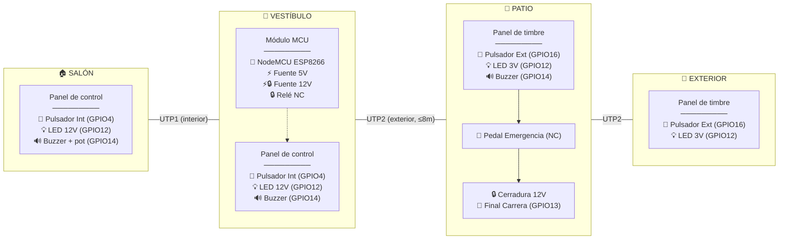

## Cableado (2 × UTP Cat5, 4 pares c/u)

Distancia máxima vestíbulo → patio: **8 metros**. Distancia vestíbulo → salón: <5m.

### UTP1 — Interior (vestíbulo ↔ salón)

| Par | Hilo | Señal | Emoji | Grupo |
|-----|------|-------|-------|-------|
| 1 | BL | GPIO4 (pulsador interno) | 🔹 | Entradas |
| 1 | NA | (libre) | | |
| 2 | BL/V | **12V** (alimentación salón, paralelo con V) | ⚡ | Power |
| 2 | V | **12V** (alimentación salón, paralelo con BL/V) | ⚡ | Power |
| 3 | BL/AZ | GPIO14 (buzzer musical) | 🔊 | Audio |
| 3 | AZ | GPIO12 (PWM LEDs) | 💡 | Broadcast |
| 4 | BL/MR | **GND** (retorno salón, paralelo con MR) | ⬛ | Power |
| 4 | MR | **GND** (retorno salón, paralelo con BL/MR) | ⬛ | Power |

### UTP2 — Exterior (vestíbulo ↔ patio, ≤8m, cobre sólido)

Relé **conmuta +12V** (high-side switching).

| Par | Hilo | Señal | Emoji | Corriente | Grupo |
|:---:|:----:|-------|:-----:|:---------:|-------|
| 1 | BL | **12V always** (periféricos) | ⚡ | 0.3A | Power |
| 1 | NA | **12V lock switched** (vía relé NC) | 🔒 | **1.5A** | Power |
| 2 | BL/V | GPIO16 (pulsador externo) | 🔸 | <1mA | Entradas |
| 2 | V | GPIO13 (final carrera, pull-up 10kΩ ext.) | 🚪 | <1mA | Patio |
| 3 | BL/AZ | GPIO14 (buzzer patio) | 🔊 | <1mA | Audio |
| 3 | AZ | GPIO12 (PWM LEDs externos) | 💡 | <1mA | Broadcast |
| 4 | BL/MR | **GND común** (lock + periféricos, paralelo con MR) | ⬛ | **1.8A** | Power |
| 4 | MR | **GND común** (lock + periféricos, paralelo con BL/MR) | ⬛ | **1.8A** | Power |

- 12V always (Par 1 BL) alimenta periféricos; 12V lock (Par 1 NA) conmutado por relé NC alimenta la cerradura
- Relé NC en vestíbulo conmuta +12V: **OFF** → NC cerrado → 12V al lock → cerradura activa. **ON** → NC abierto → lock sin 12V → desbloqueado
- GND común por Par 4 completo (2 hilos paralelo): ~0.9A por hilo, disipación balanceada
- Caída de tensión a 8m con cobre: lock recibe ~10.4V (~87% fuerza) ✅✅
- Cada panel solo pela los pares que necesita

## 3. Asignación de Pines

| GPIO | Emoji | Componente | Tipo |
|------|-------|-----------|------|
| GPIO4 | 🔹 | Pulsadores internos (salón + vestíbulo, paralelo) | Entrada (pull-up, invertido) |
| GPIO16 | 🔸 | Pulsadores externos (patio + exterior, paralelo) | Entrada (pull-up ext.) |
| GPIO12 | 💡 | PWM LEDs — señal común a todas las zonas | Salida (PWM) |
| GPIO14 | 🔊 | Buzzer Musical (×3: salón, vestíbulo, patio; salón con pot. serie) | Salida (PWM 2000 Hz, RTTTL) |
| GPIO5 | 🔒 | Relé de Cerradura high-side (NC → +12V lock, COM → 12V) | Salida (relé) |
| GPIO13 | 🚪 | Final de Carrera + detección emergencia | Entrada (pull-up, NA) |

## 4. Definición de Componentes

### 4.1 Pulsadores Internos (panel de control)
- **Pin**: GPIO4, `INPUT_PULLUP`, invertido. Paralelo salón + vestíbulo.
- **Pulsación corta** (< 4s): ejecuta `internal_press` (solo en ACTIVADO)
- **Pulsación larga** (> 4s): si sistema DESACTIVADO → `enable_system`
- **Pulsación muy larga** (> 8s): si sistema ACTIVADO → `disable_system`

```yaml
binary_sensor:
  - platform: gpio
    pin:
      number: GPIO4
      inverted: true
      mode: INPUT_PULLUP
    id: pulsador_interno
    filters:
      - delayed_on_off: 50ms
    on_click:
      - min_length: 50ms
        max_length: 3900ms
        then:
          - lambda: |-
              if (id(system_active))
                id(internal_press_script).execute();
      - min_length: 4100ms
        max_length: 8000ms
        then:
          - lambda: |-
              if (!id(system_active))
                id(enable_system_script).execute();
      - min_length: 8100ms
        max_length: 60000ms
        then:
          - lambda: |-
              if (id(system_active))
                id(disable_system_script).execute();
```

### 4.2 Pulsadores Externos (panel de timbre)
- **Pin**: GPIO16, `INPUT` con pull-up ext. 10kΩ. Paralelo patio + exterior.
- **Pulsación corta** (< 4s): ejecuta `external_press` (solo timbre, NO desbloquea)
- Pulsaciones largas ignoradas (solo el panel de control interno tiene función de mantenimiento)

```yaml
binary_sensor:
  - platform: gpio
    pin: GPIO16
    id: pulsador_externo
    filters:
      - delayed_on_off: 50ms
    on_click:
      - min_length: 50ms
        max_length: 3900ms
        then:
          - script.execute: external_press_script
```

### 4.3 Relé
- GPIO5. **ID**: `lock_relay`
- Conmutación **high-side**: el relé abre/cierra el +12V de la cerradura.
- **OFF** → NC cerrado → +12V al lock → cerradura recibe 12V → puerta cerrada
- **ON** → NC abierto → lock sin 12V → cerradura sin corriente → puerta desbloqueada
- NA no se usa

```yaml
output:
  - platform: gpio
    pin: GPIO5
    id: lock_relay
```

### 4.4 Final de Carrera
- GPIO13. INPUT con pull-up externo 10kΩ a 3.3V en el vestíbulo (junto al MCU). No usar `INPUT_PULLUP` interno (30-100kΩ): su alta impedancia es más susceptible a ruido acoplado en 8m de cable UTP.
- **ON**: puerta abierta. **OFF**: puerta cerrada.
- Si se activa con relé OFF → apertura por emergencia
- **Al cerrar la puerta** (FC → OFF): si el LED está en flash lento (estado puerta abierta), vuelve a 25% reposo. No afecta al cooldown externo.

```yaml
binary_sensor:
  - platform: gpio
    pin:
      number: GPIO13
      mode: INPUT
    id: final_carrera
    filters:
      - delayed_on_off: 100ms
    on_press:
      then:
        - lambda: |-
            if (!id(desbloqueo_normal_activo) && !id(lock_relay_on))
              id(emergency_alert_script).execute();
    on_release:
      then:
        - script.stop: emergency_alert_script
        - script.stop: gate_open_flash_script
        - lambda: |-
            if (id(system_active) && !id(desbloqueo_normal_activo)
                && id(safe_lock_enabled).state && id(lock_relay_on)) {
              id(lock_relay).turn_off();
              id(lock_relay_on) = false;
            }
        - light.turn_off: led_light
        - light.turn_on:
            id: led_light
            brightness: 25%
            transition_length: 1s
        - output.turn_off: buzzer_output
```

### 4.5 Buzzer Musical (RTTTL)
- GPIO14 (PWM) → Par 3 BL/AZ de **ambos UTPs**. La señal PWM 3.3V viaja en paralelo al salón (UTP1) y al patio (UTP2) hacia la base de cada 2N5551 local. Cada transistor conmuta 12V local al BUZ12.
- Los paneles de salón, vestíbulo y patio tienen su propio 2N5551 local que recibe la señal de BL/AZ y conmuta 12V al BUZ12 (el exterior no lleva buzzer). El salón toma 12V de UTP1 Par 2, el patio de UTP2 Par 1.
- En cada panel, entre 12V y el buzzer hay un placeholder para resistencia de atenuación (0Ω = cable directo por ahora):
```
                 ┌─── R_atenuación (0Ω placeholder) ─── BUZ12(+) ── BUZ12(−)
Par 3 BL/AZ ──┤1kΩ├── base 2N5551                   └─── colector 2N5551
                                                emisor 2N5551 ── GND
```
- El panel de salón adicionalmente tiene un potenciómetro de 10kΩ en serie entre BL/AZ y la base del 2N5551 (divisor de tensión) para ajuste local de volumen.
- Si a futuro el volumen es muy intenso, se reemplaza el cable por una resistencia (ej. 470Ω) en cada panel.

Todos los sonidos del sistema usan RTTTL (definidos inline en el YAML):
  - `ALL_MELODIES[]`: 4 melodías de timbre
  - `APERTURA`: sonido de desbloqueo
  - `EMERGENCIA`: alarma de emergencia
  - `ACTIVAR` / `DESACTIVAR`: activación/desactivación del sistema
  - `BEEP_FLASH`: pitido corto del flash de puerta abierta
- Cada pulsación del timbre (externo) reproduce la siguiente melodía RTTTL en secuencia.
- Al terminar el cooldown del desbloqueo interno (doorbell_led_duration), si la puerta sigue abierta (FC=ON), el índice se resetea a la melodía 1.
- Durante el desbloqueo suena el sonido RTTTL de apertura, no melodía.
- La alarma de emergencia usa RTTTL.

```yaml
rtttl:
  output: buzzer_output
  id: buzzer_rtttl

output:
  - platform: esp8266_pwm
    pin: GPIO14
    frequency: 2000Hz
    id: buzzer_output
```

### 4.6 LEDs Estado
- GPIO12 PWM → Par 3 AZ de **ambos UTPs**. Señal común a las 4 zonas (salón por UTP1, patio/exterior por UTP2).
- Cada panel tiene su propia conversión local. Los externos comparten un mismo 2N5551 en el panel del patio:

**Paneles internos (salón, vestíbulo)** — Tira LED 12V transistorizada (alimentación por UTP1):
```
UTP1 Par 3 AZ ──┤1kΩ├── base 2N5551
UTP1 Par 2 (12V) ── tira LED (+) ── tira LED (−) ── colector
UTP1 Par 4 (GND) ── emisor
```
(La tira LED incluye resistor limitador serie incorporado.)

**Paneles externos (patio, exterior)** — LED con driver 12V (ambos LEDs en paralelo, mismo 2N5551, alimentación por UTP2):
```
UTP2 Par 1 (12V) ──┤1kΩ├── LED(+) ── LED(–) ─┐
                                       ┌────────┤ colector 2N5551
                               LED(+) ─┘        │
                                                emisor ── GND
UTP2 Par 3 AZ ──┤1kΩ├── base 2N5551
```
(Un 2N5551 conmuta 12V para ambos LEDs externos. La R de 1kΩ en colector limita la corriente a ~9mA total.)

- PWM desde GPIO12 controla todo, los cuatro LEDs reciben el mismo brillo.
- **Efectos:**
  - *Latido suave*: oscilación 50%–100% con transición de 1s
  - *Parpadeo rápido (unlock)*: 67ms ON / 67ms OFF, sincronizado con melodía APERTURA
  - *Flash lento*: duración configurable (`gate_open_flash_interval`), acompañado de pitido corto

```yaml
output:
  - platform: esp8266_pwm
    pin: GPIO12
    frequency: 1000Hz
    id: led_output

light:
  - platform: monochromatic
    output: led_output
    id: led_light
    name: "LED Estado"
    default_transition_length: 0s
    effects:
      - pulse:
          name: "Latido Suave"
          transition_length: 1s
          update_interval: 1s
          min_brightness: 50%
          max_brightness: 100%
      - strobe:
          name: "Flash Rapido"
          colors:
            - state: true
              brightness: 100%
              duration: 400ms
            - state: false
              duration: 400ms
```

## 5. Estado del Sistema

El sistema tiene dos estados:

| Estado | Relé | Pulsadores | LED | Uso |
|--------|------|-----------|-----|-----|
| **ACTIVADO** (boot) | OFF (puerta cerrada) | Operación normal | 25% brillo (reposo) | Uso diario |
| **DESACTIVADO** | ON (puerta desbloqueada) | Ignorados (excepto >4s) | OFF | Mantenimiento / emergencia |

Transiciones:
- Boot → ACTIVADO
- ACTIVADO + pulsación interna >8s → DESACTIVADO
- DESACTIVADO + pulsación interna >4s → ACTIVADO

## 6. Detección de Emergencia

```
Al recibir final carrera = ON:
  Si desbloqueo_normal_activo OR lock_relay está ON
     → desbloqueo normal en curso (relé queda ON, cerradura sin 12V)
       El auto-lock ocurre silenciosamente cuando FC detecta cierre
  Si no
     → apertura no autorizada (pedal/forzada) → emergency_alert
```

El flag `desbloqueo_normal_activo` se pone a true al iniciar `unlock_gate`
y se limpia al terminar. Así un FC ON que llegue justo después de apagar
el relé no se confunde con emergencia.

## 7. Comportamiento

| Evento | 🔒 Relé | 🔊 Buzzer | 💡 LED |
|--------|:------:|:--------:|:-----:|
| **Sistema DESACTIVADO** | ON (perm.) | — | OFF |
| **Sistema ACTIVADO** (reposo, boot) | — | — | 25% |
| 🔹 >4s (DESACT → ACTIVAR) | OFF | Secuencia activación | 3 flashes → 25% |
| 🔹 >8s (ACTIV → DESACTIVAR) | ON (perm.) | Secuencia desactivación | 3 flashes → OFF |
| 🔸 Externo (ACTIVADO) | — | Melodía actual | Latido 100% `doorbell_led_duration` |
| 🔹 Interno (ACTIVADO) | ON `unlock_duration` | RTTTL Apertura | 100% + 67ms parpadeo |
| 🚪 Abierta tras desbloqueo | OFF | Pitido c/flash | Flash lento `gate_open_flash_interval` |
| 🚪 Cerrada tras desbloqueo | OFF | — | 25% |
| 🚪 FC → OFF (cierra) | — | — | Si estaba en flash lento → 25% |
| 🚨 Emergencia (🚪ON + 🔒OFF) | — | RTTTL Emergencia (×4) | LED sincronizado 1067ms ON / 133ms OFF |

Mientras el sistema está DESACTIVADO el relé permanece ON y cualquier pulsación (externa o interna) es ignorada.
Los pulsadores externos **nunca desbloquean** la puerta — solo tocan el timbre.
El cooldown del pulsador externo es independiente del interno (cada uno con su bandera).
Al cerrar la puerta (FC→OFF) el LED vuelve a 25% si estaba en flash lento.

## 8. Scripts

### 8.1 `external_press` (patio / exterior — timbre)
```
1. Si sistema DESACTIVADO → salir
2. Si cooldown_externo_activo → salir (ignorar)
3. cooldown_externo_activo = true
4. Cancelar timer_reset_melodia (si existe)
5. Reproducir melodía actual (RTTTL, no bloqueante)
6. LED → LATIDO SUAVE al 100%
7. Esperar doorbell_led_duration
8. LED → 25% (reposo)
9. cooldown_externo_activo = false
10. índice de melodía + 1
11. Iniciar timer_reset_melodia (60s)
```

El cooldown usa una bandera propia (`cooldown_externo_activo`), no el
estado del LED. Así el externo y el interno son completamente independientes.

Si transcurren 60s sin una nueva pulsación externa, el timer resetea
el índice de melodía a 0. Si ocurre una nueva pulsación antes, el
timer se cancela (paso 4) y se reinicia al final del cooldown (paso 11).

```yaml
  - id: external_press_script
    mode: single
    then:
      - if:
          condition:
            lambda: 'return id(system_active)
                     && !id(cooldown_externo_activo);'
          then:
            - lambda: 'id(cooldown_externo_activo) = true;'
            - script.stop: timer_reset_melodia
            - output.turn_off: buzzer_output
            - lambda: |-
                switch (id(melody_index)) {
                  case 0: id(buzzer_rtttl).play("d=8,o=6,b=140:..."); break;
                  case 1: ...  // 4 melodías rotativas
                }
            - light.turn_on:
                id: led_light
                effect: "Latido Suave"
                brightness: 100%
            - delay: !lambda 'return id(doorbell_led_duration_ms);'
            - light.turn_off: led_light
            - light.turn_on:
                id: led_light
                brightness: 25%
                transition_length: 1s
            - lambda: 'id(cooldown_externo_activo) = false;'
            - lambda: 'id(melody_index) = (id(melody_index) + 1) % 4;'
            - script.execute: timer_reset_melodia
```

### 8.2 `internal_press` (salón / vestíbulo — abrir puerta)
```
1. Si sistema DESACTIVADO → salir
2. Ejecutar unlock_gate
3. Verificar FC inmediatamente:
   SI puerta abierta → LED → flash lento + pitido (gate_open_flash)
                       índice de melodía → 0 (reseta playlist)
                       esperar doorbell_led_duration (cooldown)
   SI puerta cerrada → esperar doorbell_led_duration (tiempo de bloqueo)
                       → verificar FC otra vez
                         SI abierta → flash lento + pitido
                         SI cerrada → LED → 25% (reposo)
```

El interno no reproduce melodía, no avanza el índice de melodía,
y no comparte cooldown con el externo — son independientes.

```yaml
  - id: internal_press_script
    mode: single
    then:
      - if:
          condition:
            lambda: 'return id(system_active);'
          then:
            - script.stop: emergency_alert_script
            - output.turn_off: buzzer_output
            - script.execute: unlock_gate_script
            - if:
                condition:
                  binary_sensor.is_on: final_carrera
                then:
                  - lambda: 'id(melody_index) = 0;'
                  - script.execute: gate_open_flash_script
                  - delay: !lambda 'return id(doorbell_led_duration_ms);'
                else:
                  - delay: !lambda 'return id(doorbell_led_duration_ms);'
                  - if:
                      condition:
                        binary_sensor.is_on: final_carrera
                      then:
                        - script.execute: gate_open_flash_script
                      else:
                        - light.turn_off: led_light
                        - light.turn_on:
                            id: led_light
                            brightness: 25%
                            transition_length: 1s
```

### 8.3 `unlock_gate`
```
1. desbloqueo_normal_activo = true
2. Relé → ON. Detener RTTTL anterior. LED → 100%.
3. Reproducir RTTTL APERTURA una vez (se ejecuta en background).
4. Bucle hasta unlock_duration:
   a. LED sincronizado: 67ms ON / 67ms OFF
   b. Verificar FC cada 10ms:
      - FC se abre (puerta abierta):
        * Detener RTTTL
        * Arranca grace timer (unlock_grace_ms, default 2s)
        * Grace expira → buzzer OFF, relay sigue ON
        * FC se cierra (puerta cerrada) → Relay → OFF. Return inmediato.
      - FC nunca se abre → timeout normal.
5. Timeout:
   - Si FC = OFF (puerta cerrada) O Safe Lock = OFF → Relé → OFF
   - Si Safe Lock = ON + puerta abierta → relay queda ON, FC on_release auto-lock
6. Detener RTTTL. Apagar buzzer.
7. LED → 25% (reposo, transición 1s)
8. desbloqueo_normal_activo = false
```

> Durante el desbloqueo el LED sigue el ritmo de la melodía APERTURA. El Safe Lock (toggle vía web) evita que el lock se energice con la puerta abierta. Al cerrar la puerta, el FC on_release ejecuta auto-lock si relay está aún ON.

El RTTTL APERTURA se genera dinámicamente en lambda para cubrir exactamente `unlock_duration_ms`:

```yaml
          // play RTTTL with exact duration matching unlock_duration_ms
          {
            int total_notes = (id(unlock_duration_ms) / 67) + 4;
            std::string rtttl = "d=16,o=7,b=225:";
            for (int i = 0; i < total_notes; i++) {
              rtttl += (i % 2 == 0) ? "c" : "p";
              if (i < total_notes - 1) rtttl += ",";
            }
            id(buzzer_rtttl).play(rtttl);
          }
```

El bucle principal monitorea FC y sincroniza el LED con `yield()` para alimentar WDT:

```yaml
          while (millis() - start < timeout) {
            yield();  // mantiene WiFi y loop principal
            unsigned long now = millis();

            if (!door_was_opened && id(final_carrera).state) {
              door_was_opened = true;
              grace_start = now;
              id(buzzer_rtttl).stop();
              id(buzzer_output).turn_off();
            }

            if (door_was_opened && !id(final_carrera).state) {
              // door closed → lock immediately
              id(lock_relay).turn_off();
              id(lock_relay_on) = false;
              ...
              return;
            }
            // LED toggling at 67ms
            if (now - last_toggle >= 67) { ... }

            delay(10);
          }
```

### 8.4 `flash_and_beep`
Reproduce el sonido de **apertura** (RTTTL) una vez al inicio del desbloqueo, se ejecuta en background mientras el bucle monitorea FC y LED. La cadena RTTTL se genera dinámicamente en lambda con el número exacto de notas (`c,p`) para cubrir `unlock_duration_ms`, evitando una cadena hardcodeada de cientos de caracteres:

```
d=16,o=7,b=225:c,p,c,p,c,p,c,p,... (generado en tiempo real)
```

El sonido se inicia al activar el relé y se reproduce hasta que:
- La puerta se abre: se detiene el RTTTL, luego silencio durante grace.
- El FC detecta cierre de puerta: fin inmediato, relay → OFF.
- Expira `unlock_duration`: fin forzado.

El LED parpadea sincronizado: 67ms ON (nota) / 67ms OFF (silencio). Tras el desbloqueo, el LED vuelve a 25% y `internal_press` gestiona el estado final.

```yaml
  - id: gate_open_flash_script
    mode: single
    then:
      - while:
          condition:
            binary_sensor.is_on: final_carrera
          then:
            - light.turn_on:
                id: led_light
                brightness: 100%
                transition_length: 0s
            - lambda: 'id(buzzer_rtttl).play("d=8,o=5,b=300:b");'
            - delay: 100ms
            - light.turn_off:
                id: led_light
                transition_length: 0s
            - delay: !lambda 'return id(gate_open_flash_interval_ms) - 100;'
```

### 8.5 `enable_system`
```
1. Sistema → ACTIVADO
2. Reproducir arpegio ascendente (RTTTL ACTIVAR)
   d=4,o=5,b=320:c,16p,e,16p,g,16p,c6
3. LED: 4 flashes sincronizados (190ms on / 45ms off) → 25% (reposo)
4. Relé → OFF (cerradura bloqueada)
```

La secuencia de 4 flashes usa la acción nativa `repeat`:

```yaml
      - lambda: 'id(buzzer_rtttl).play("d=4,o=5,b=320:c,16p,e,16p,g,16p,c6");'
      - repeat:
          count: 4
          then:
            - light.turn_on: { id: led_light, brightness: 100% }
            - delay: 190ms
            - light.turn_off: led_light
            - delay: 45ms
      - light.turn_on: { id: led_light, brightness: 25% }
```

### 8.6 `disable_system`
```
1. Sistema → DESACTIVADO
2. Reproducir arpegio descendente (RTTTL DESACTIVAR)
   d=4,o=5,b=320:c6,16p,g,16p,e,16p,c
3. LED: 4 flashes sincronizados (190ms on / 45ms off) → OFF
4. Relé → ON permanentemente (cerradura desbloqueada)
```

Mismo patrón de 4 flashes que `enable_system`, pero con arpegio descendente y sin volver a 25%:

```yaml
      - lambda: 'id(buzzer_rtttl).play("d=4,o=5,b=320:c6,16p,g,16p,e,16p,c");'
      - repeat:
          count: 4
          then:
            - light.turn_on: { id: led_light, brightness: 100% }
            - delay: 190ms
            - light.turn_off: led_light
            - delay: 45ms
      - output.turn_on: lock_relay
      - lambda: 'id(lock_relay_on) = true;'
```

### 8.7 `emergency_alert`
```
1. Alarma de emergencia (RTTTL): se repite en bucle hasta 60s
   d=1,o=6,b=225:c,8p,c,8p,c,8p,c,8p  (~4.8s cada ciclo)
2. LED sincronizado: 1067ms ON / 133ms OFF (sigue patrón c,8p)
3. El bucle se corta si:
   - Se presiona el pulsador interno (→ unlock_gate)
   - La puerta se cierra (FC → OFF)
4. Al terminar (bucle completo o corte):
   Si sigue abierta → flash lento + pitido (gate_open_flash_interval)
   Si no → LED → 25% (reposo), silencio
```

```yaml
  - id: emergency_alert_script
    mode: single
    then:
      - rtttl.stop: id: buzzer_rtttl
      - output.turn_off: buzzer_output
      - lambda: 'id(emergency_cycle) = 0;'
      - while:
          condition:
            and:
              - lambda: 'return id(emergency_cycle) < 12;'
              - binary_sensor.is_on: final_carrera
          then:
            - lambda: 'id(buzzer_rtttl).play("d=1,o=6,b=225:c,8p,c,8p,c,8p,c,8p");'
            - lambda: |
                for (int i = 0; i < 4 && id(final_carrera).state; i++) {
                  // LED 1067ms ON
                  { auto call = id(led_light).make_call();
                    call.set_brightness(1.0f);
                    call.set_transition_length(0);
                    call.perform(); }
                  unsigned long t = millis();
                  while (millis() - t < 1067 && id(final_carrera).state)
                    { yield(); delay(10); }
                  // LED 133ms OFF
                  ...
                }
            - lambda: 'id(emergency_cycle)++;'
      - output.turn_off: buzzer_output
      - if:
          condition: binary_sensor.is_on: final_carrera
          then: - script.execute: gate_open_flash_script
          else:
            - light.turn_on: { id: led_light, brightness: 25%, transition_length: 1s }
```

## 9. Comunicación

| Método | Propósito | Endpoint |
|--------|-----------|----------|
| WiFi | Red local + AP respaldo | — |
| Web Server | Panel de control | `http://<ip>/` |
| | Safe Lock toggle | `http://<ip>/switches` |
| | Sliders de tiempo | `http://<ip>/numbers` |
| OTA | Actualizaciones | — |

Sin HA, API nativa ni MQTT.

## 10. Parámetros

### Entities web (`/numbers`)

| Parámetro | ID | Default | Rango | Descripción |
|-----------|-----|---------|-------|-------------|
| Doorbell LED Duration | `doorbell_led_duration` | 45s | 10–120s | Duración del latido suave del LED al pulsar timbre |
| Gate Open Flash Interval | `gate_open_flash_interval` | 5s | 1–30s | Intervalo de flasheo del LED cuando puerta está abierta |
| Grace Duration | `unlock_grace_duration` | 2s | 0.5–10s | Tiempo que sigue sonando tras detectar apertura |
| Unlock Duration | `unlock_duration` | 5s | 1–10s | Tiempo que la cerradura permanece desbloqueada |

### Globals del sistema

| Variable | Tipo | Default | Propósito |
|----------|------|---------|-----------|
| `system_active` | bool | `true` | Sistema habilitado (true) o en mantenimiento (false) |
| `lock_relay_on` | bool | `false` | Estado actual del relé (evita leer GPIO en loop) |
| `desbloqueo_normal_activo` | bool | `false` | Flag para diferenciar apertura normal vs emergencia |
| `cooldown_externo_activo` | bool | `false` | Cooldown del pulsador externo (independiente del LED) |
| `melody_index` | int | `0` | Índice de melodía actual (0-3, ciclo) |
| `emergency_cycle` | int | `0` | Contador de ciclos de emergencia (corta en 12) |
| `unlock_duration_ms` | int | `5000` | Duración del pulso de desbloqueo (ms) |
| `doorbell_led_duration_ms` | int | `45000` | Duración del LED de timbre (ms) |
| `gate_open_flash_interval_ms` | int | `5000` | Intervalo de flasheo de puerta abierta (ms) |
| `unlock_grace_ms` | int | `2000` | Gracia tras abrir la puerta (ms) |

### Otros

| Parámetro | Default | Descripción |
|-----------|---------|-------------|
| `melody_reset_timeout` | 60s | Tiempo sin pulsaciones externas que resetea el índice de melodía a 0 |

## 11. Repertorio de Melodías (RTTTL)

4 melodías en formato RTTTL. Cada pulsación del timbre externo
reproduce la siguiente. Al llegar a la cuarta vuelve a la primera.
El ciclo se resetea a la melodía 1 al terminar el cooldown del
desbloqueo interno si la puerta sigue abierta (FC=ON).

| # | Código RTTTL |
|---|--------------|
| 1 | `d=8,o=6,b=140:c,c,g,4g,16g,16p,f,g,c,2c,p` |
| 2 | `d=8,o=6,b=140:c,g,c7,4c7,16c7,16p,b,c7,g,2g,p` |
| 3 | `d=4,o=4,b=100:c7,b,2a,16a,16p,a,d7,b,2g,p` |
| 4 | `d=4,o=4,b=100:a,b,c7,g,f,e,g,4d,16d,16p,c,2c,p` |
| Apertura | Generado dinámicamente — ver sección 14.3 |
| Emergencia | `d=1,o=6,b=225:c,8p,c,8p,c,8p,c,8p` |
| ACTIVAR | `d=8,o=5,b=200:8c,8e,8g,8c6,8e6,8d6,8c6,4g` |
| DESACTIVAR | `d=8,o=5,b=200:8c6,8g,8e,8c,8a4,8g,8e,4c` |
| BEEP_FLASH | `d=8,o=5,b=300:b` |

Las cadenas se definen inline en el YAML como strings literales RTTTL.

## 12. Diagramas

### 12.1 Máquina de estados del sistema

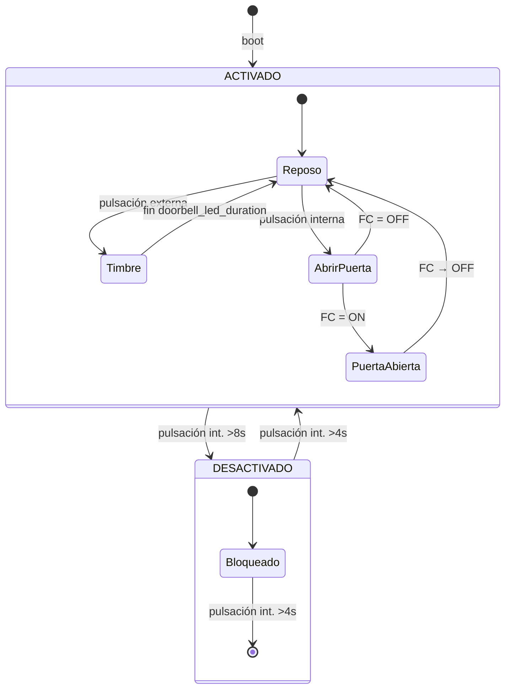

### 12.2 Diagrama general de conexiones (Vestíbulo)

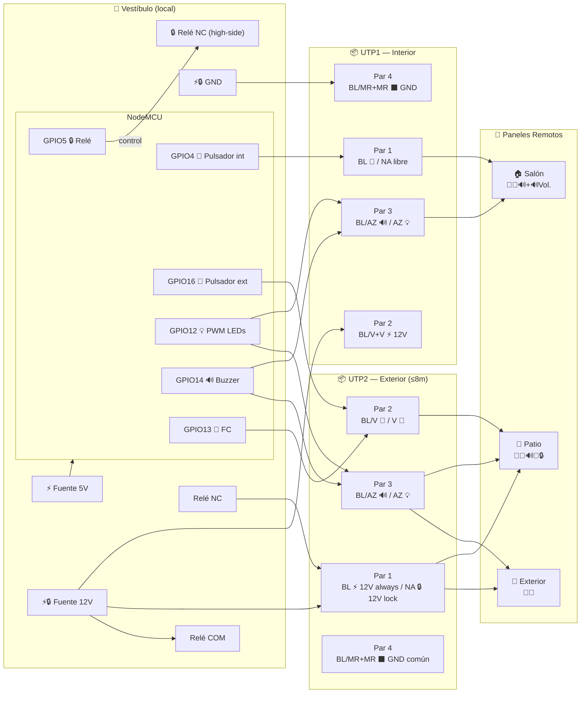

### 12.3 Circuito — Panel Interno (salón / vestíbulo) — UTP1

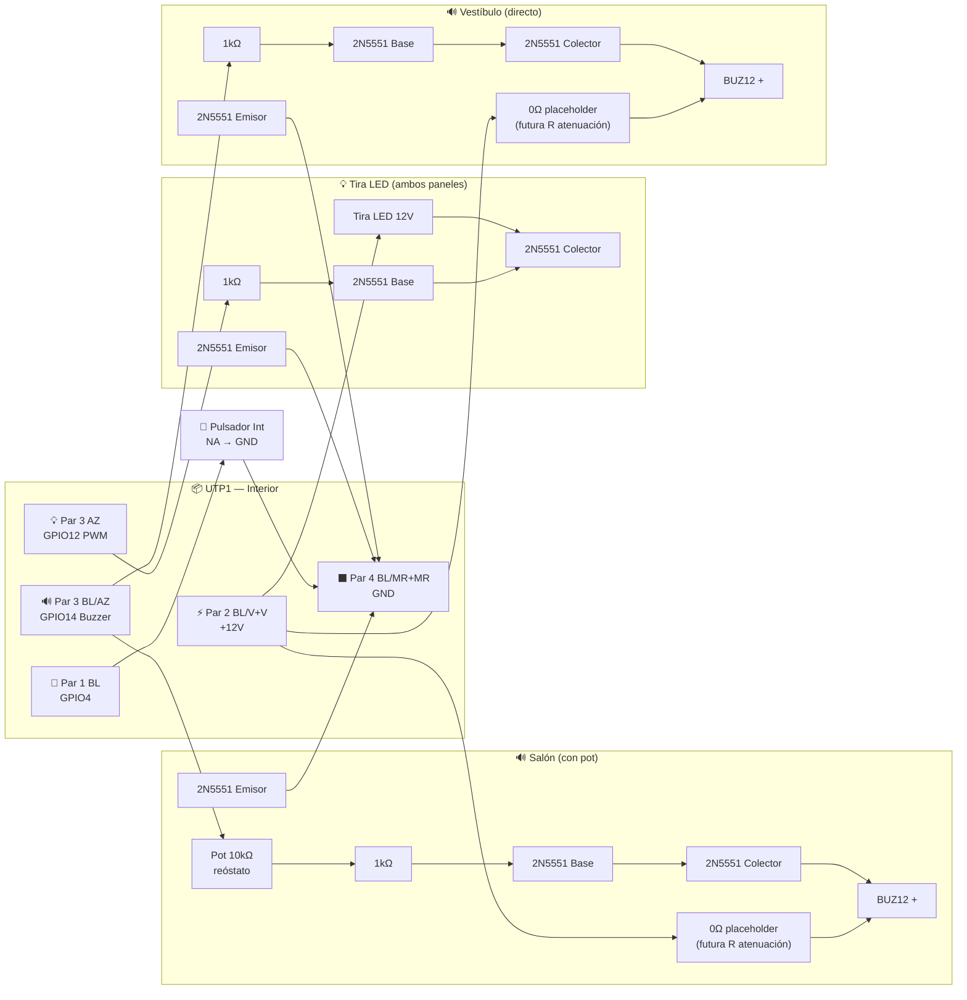

> **Panel de salón**: el buzzer lleva potenciómetro de 10kΩ entre BL/AZ y la base del 2N5551 como divisor de volumen. Entre 12V y el BUZ12 hay un placeholder para resistencia de atenuación futura (0Ω = cable directo).
> **Panel de vestíbulo**: sin potenciómetro, el 1kΩ va directo de BL/AZ a la base.
> Ambos paneles comparten el mismo circuito de LED (2N5551 + tira LED 12V).

### 12.4 Circuito — Panel Externo (patio) — UTP2

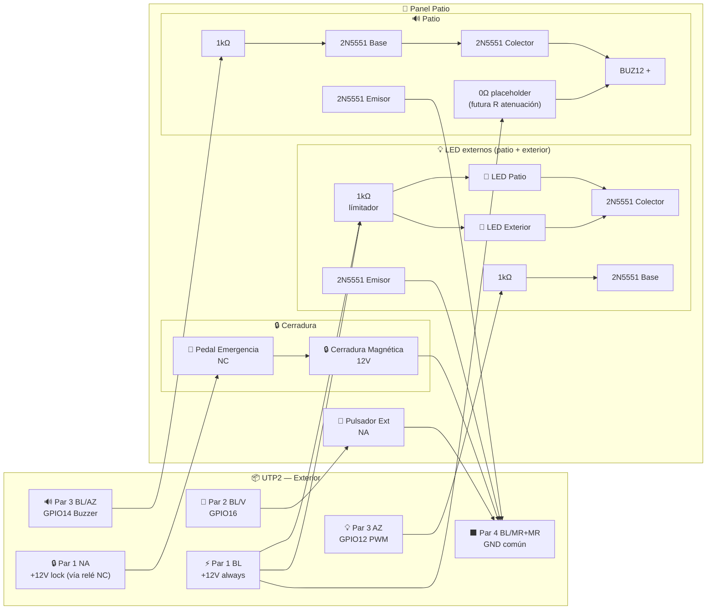

> El panel **exterior** es idéntico pero **sin el buzzer** — no conecta el hilo BL/AZ del par 3. Solo lleva pulsador (par 2 BL/V), LED (par 3 AZ con su 2N5551 en el patio) y alimentación (par 1 + par 4). Ambos LEDs externos y la cerradura comparten el GND común del par 4 (2 hilos paralelo).
> El pull-up de 10kΩ a 3.3V para GPIO16 está en el **vestíbulo**, junto al MCU.
### 12.5 Circuito — Cerradura + Pedal de Emergencia (UTP2, high-side)

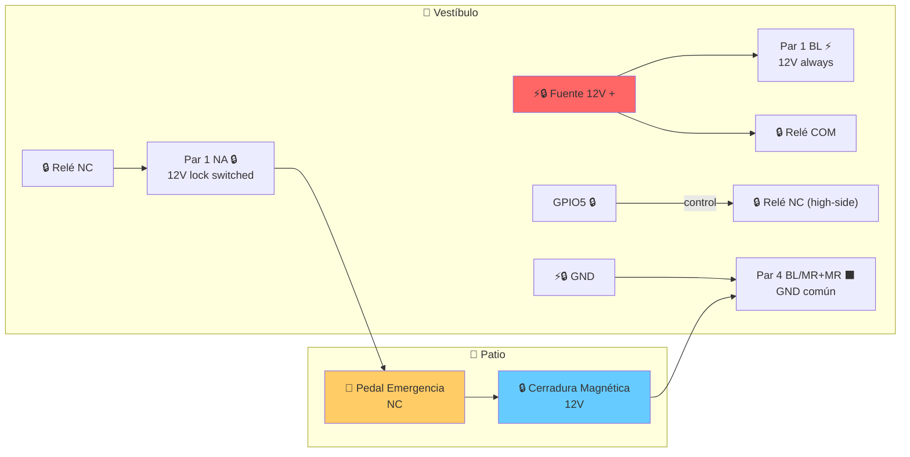

Flujo: `+12V → Relé COM → NC → Par 1 NA → Pedal NC → Cerradura → Par 4 (2 hilos) → GND`

| 🔒 Relé NC | 🚫 Pedal NC | 🔒 Cerradura |
|:----------:|:----------:|:------------:|
| Cerrado (OFF) | Cerrado | ⚡ 12V → puerta cerrada |
| Cerrado (OFF) | Abierto | ⬛ 0V → apertura emergencia |
| Abierto (ON) | — | ⬛ 0V → desbloqueo normal |

> **Safe Lock** (configurable vía web): cuando está activo, el lock solo se energiza si el FC indica puerta cerrada. Si al terminar el timeout de apertura la puerta sigue abierta, el relé queda ON (lock sin poder) hasta que el FC detecte el cierre → auto-lock inmediato. Esto evita dejar el imán activo con la puerta abierta. Toggle en `http://<esp>/switches`.
>
> **Grace Duration** (configurable vía web, por defecto 2s): tiempo que sigue sonando la melodía después de que el FC detecta que la puerta se abrió. Pasado ese lapso se apaga el buzzer aunque el relay siga ON esperando el cierre. Ajustable en `http://<esp>/numbers`.

### 12.6 Pull-ups de pulsador externo y final carrera

Los pull-ups de 10kΩ para GPIO16 y GPIO13 están en el **vestíbulo**, junto al MCU. No en los paneles remotos.

**GPIO16** viaja por UTP2 Par 2 BL/V. **GPIO13** viaja por UTP2 Par 2 V.

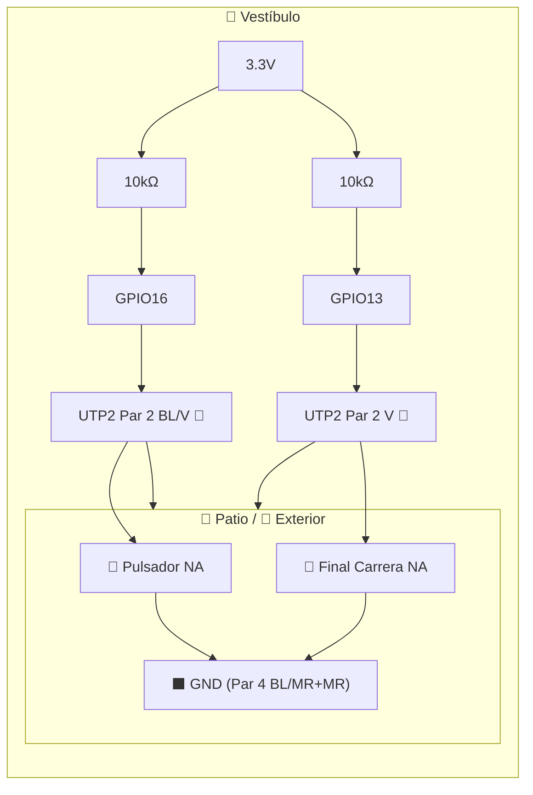

### 12.7 Swimlane — `external_press`

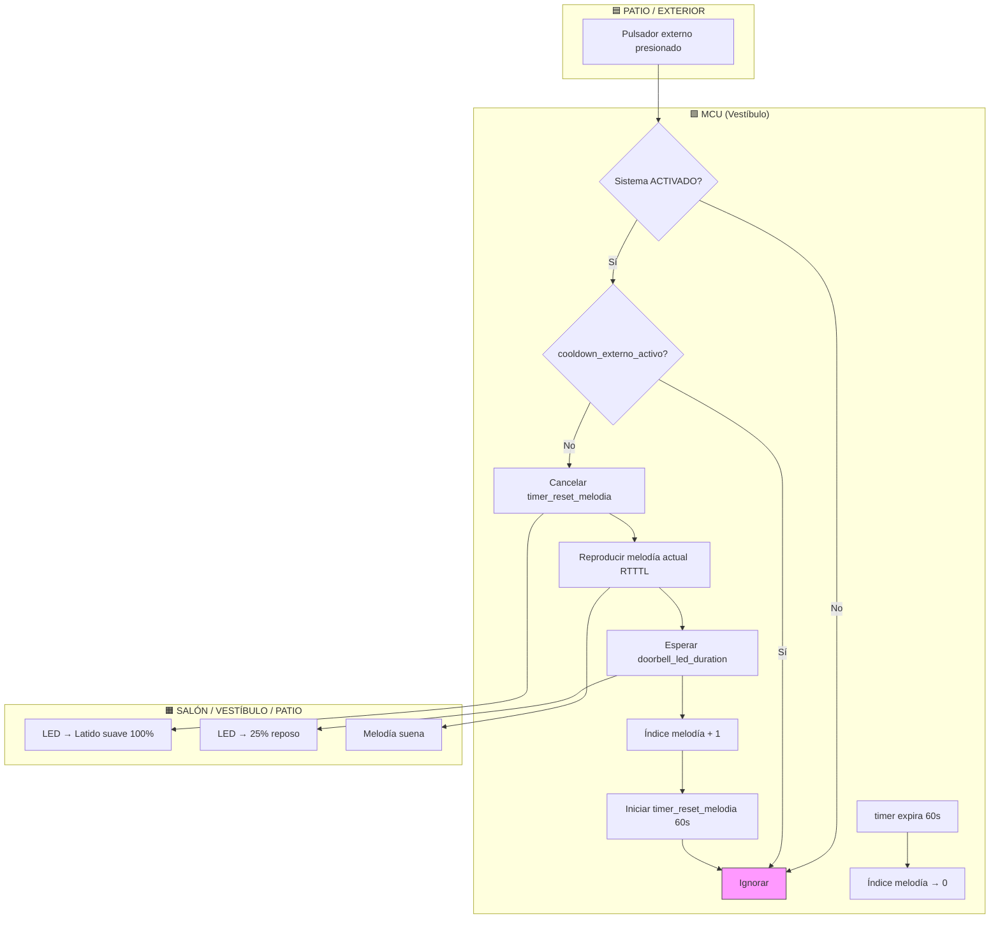

### 12.8 Swimlane — `internal_press`

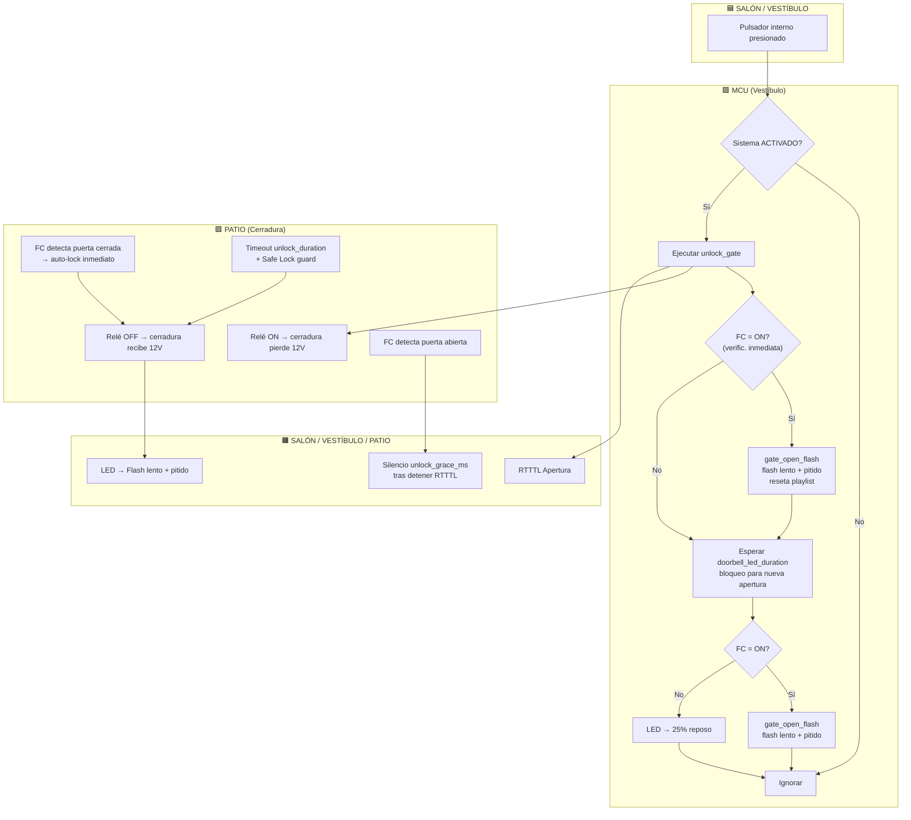

### 12.9 Swimlane — `unlock_gate`

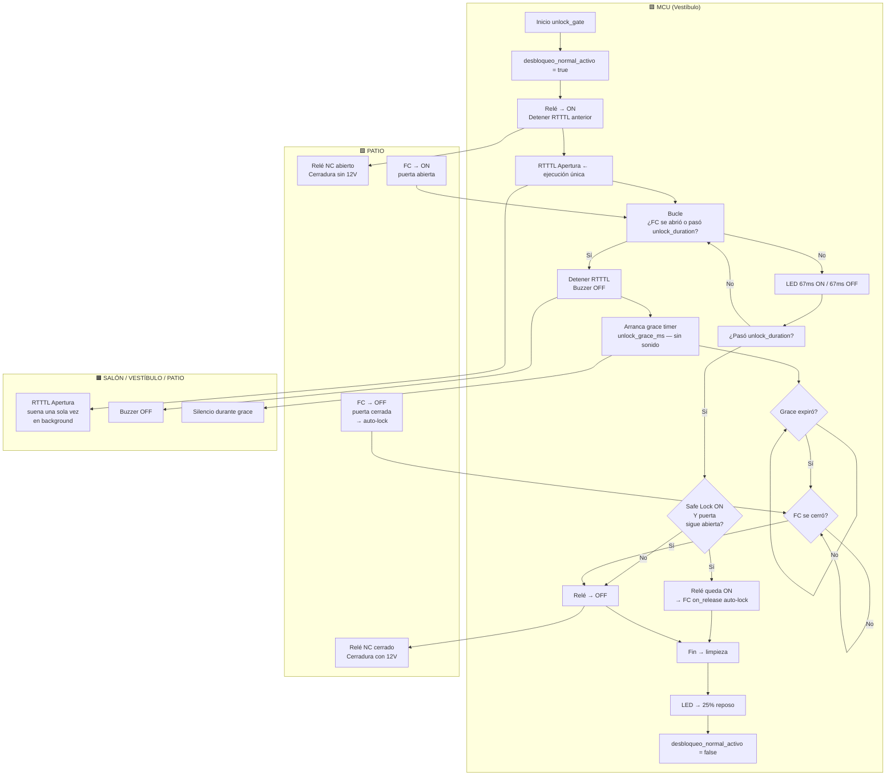

### 12.10 Swimlane — Detección de emergencia

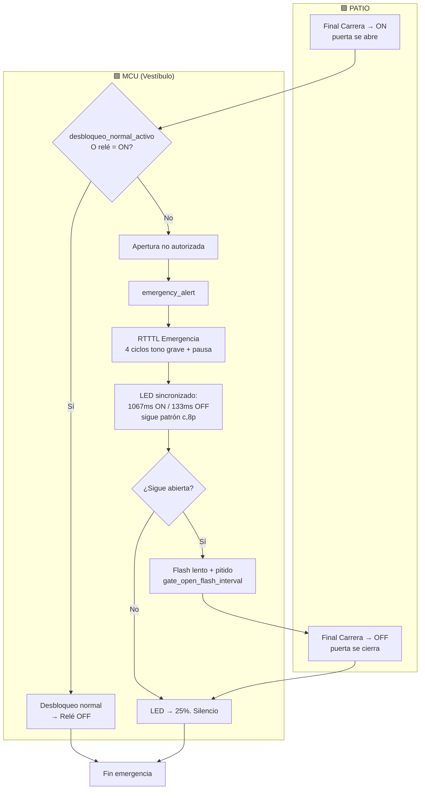

> Si **Safe Lock** está activo y el relé quedó ON (lock sin poder, puerta abierta), al abrirse la puerta `EVT → relé = ON → NORMAL` → no hay emergencia. El auto-lock ocurre silenciosamente cuando el FC detecta el cierre (`on_release`).

## 13. Archivos

```
esphome-gate/
└── esphome-gate.yaml      # Configuración ESPHome (incluye RTTTL inline)
```

## 14. Notas de Diseño

### 14.1 GPIO13 — INPUT + external pull-up 10kΩ

Se evaluó usar `INPUT_PULLUP` interno (~30-100kΩ) pero se descartó por la longitud del cable UTP2 (≤8m, cobre sólido). Un pull-up de alta impedancia en un cable de 8m forma una antena eficiente para ruido electromagnético (proveniente del relé, la conmutación del lock a 1.5A, y acoplamiento capacitivo entre pares del UTP). El resistor externo de 10kΩ provee una impedancia 3-10× menor, reduciendo drásticamente la tensión inducida.

### 14.2 unlock_gate — while loop C++ con `yield()`

Se evaluó reemplazar el bucle C++ por la acción nativa `wait_until` de ESPHome para evitar cualquier riesgo de bloqueo del loop principal. Se descartó porque:

- El script requiere sincronización precisa del LED a 67ms (2.5 semicyclos de red a 50Hz), difícil de lograr con acciones YAML sin un bucle.
- La máquina de estados interna (FC abierto → grace timer → FC cerrado) usa 4 variables booleanas compartidas que serían difíciles de mantener en YAML puro con scripts anidados.
- El bucle ya incluye `yield()` al inicio de cada iteración, lo que cede control al loop de ESPHome y al stack WiFi. El `delay(10)` al final solo espera el próximo tick de 10ms. No se han observado reseteos por WDT ni desconexiones WiFi durante pruebas.

### 14.3 RTTTL generado dinámicamente

La cadena RTTTL de apertura `"d=16,o=7,b=225:c,p,..."` se genera en tiempo de ejecución con el número de notas necesario para cubrir exactamente `unlock_duration_ms`. Esto ahorra ~350 bytes de Flash y se adapta automáticamente al slider web de duración de desbloqueo (sección 10).

