# ESPHome Puerta + Timbre — Definición del Sistema

Sistema autónomo para control de acceso de puerta con timbre musical,
apertura temporizada, señalización visual y audible, y corte de
emergencia físico. Basado en NodeMCU ESP8266 con ESPHome, sin
dependencia de Home Assistant ni MQTT. Todo el cableado entre zonas
sobre un solo UTP Cat5 de 4 pares, sin cables adicionales.

## Distribución Física

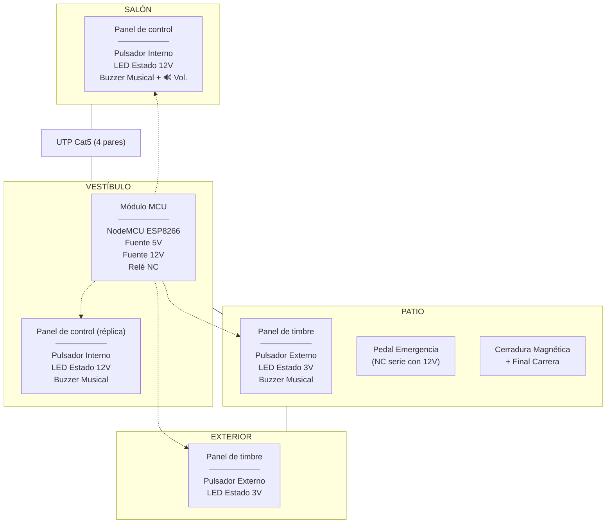

## Cableado (UTP Cat5, 4 pares)

| Par | Hilo | Señal | Emoji | Destino | Grupo |
|-----|------|-------|-------|---------|-------|
| 1 | BL | GPIO4 (pulsador interno) | 🔹 | Salón | Entradas |
| 1 | NA | GPIO16 (pulsador externo) | 🔸 | Patio + Ext. | Entradas |
| 2 | BL/V | GPIO13 (final carrera) | 🚪 | Patio | Patio |
| 2 | V | Cerradura 12V (vía relé NC) | 🔒 | Patio | Patio |
| 3 | BL/AZ | GPIO14 (buzzer musical) | 🔊 | Salón + Vest. + Patio | Audio |
| 3 | AZ | GPIO12 (PWM LEDs) | 💡 | Todas | Broadcast |
| 4 | BL/MR | **GND común** | ⬛ | Todas | Power |
| 4 | MR | **12V siempre vivo** | ⚡ | Todas | Power |

- Par 1 = botones, par 2 = patio (FC + cerradura), par 3 = audio (BL/AZ) + broadcast LED (AZ), par 4 = alimentación
- Los paneles de salón, vestíbulo y patio llevan buzzer (GPIO14 por par 3 BL/AZ). El de salón adicionalmente tiene un potenciómetro de 10kΩ en serie (reóstato) para ajuste local de volumen. El exterior no lleva buzzer.
- 12V viaja por par 4 MR junto con GND (par 4 BL/MR) — mejor para la fuente
- Relé NC en vestíbulo conmuta 12V desde par 4 MR hacia par 2 V → cerradura en patio
- Cada panel solo pela los pares que necesita (ej. exterior solo pares 1, 3 AZ, 4 — sin BL/AZ)

## 1. Resumen de Hardware

| Emoji | Componente | Propósito |
|-------|-----------|-----------|
| 🧠 | NodeMCU ESP8266 | Microcontrolador ejecutando ESPHome |
| ⚡ | Fuente 5V | Alimentación NodeMCU (local en vestíbulo) |
| ⚡🔒 | Fuente 12V | Alimentación cerradura + LEDs (local en vestíbulo) |
| 🔒 | Relé | Conmuta 12V de la cerradura (NC = cerrada) |
| 🔒 | Cerradura Magnética | Mantiene la puerta cerrada mientras recibe 12V |
| 🔊 | Buzzer Musical (RTTTL) | Zumbador piezoeléctrico — melodía y pitidos. ×3 unidades (salón con pot. volumen serie) |
| 🔹 | Pulsadores Internos (×2) | Salón y vestíbulo — GPIO4 en paralelo |
| 🔸 | Pulsadores Externos (×2) | Patio y exterior — GPIO16 en paralelo |
| 💡 | LEDs Estado (×4) | 12V internos, 3V externos |
| 🔹💡 | Transistor NPN BC337 (×2) | Paneles internos — conmutan 12V al LED desde GPIO12 |
| 🚪 | Final de Carrera (NA) | GPIO13 — detecta puerta abierta/cerrada |
| 🚫 | Pedal de Emergencia | Corte físico NC en serie con 12V de la cerradura |

## 2. Asignación de Pines

| GPIO | Emoji | Componente | Tipo |
|------|-------|-----------|------|
| GPIO4 | 🔹 | Pulsadores internos (salón + vestíbulo, paralelo) | Entrada (pull-up, invertido) |
| GPIO16 | 🔸 | Pulsadores externos (patio + exterior, paralelo) | Entrada (pull-up ext.) |
| GPIO12 | 💡 | PWM LEDs — señal común a todas las zonas | Salida (PWM) |
| GPIO14 | 🔊 | Buzzer Musical (×3: salón, vestíbulo, patio; salón con pot. serie) | Salida (PWM 2000 Hz, RTTTL) |
| GPIO5 | 🔒 | Relé de Cerradura (NC → lock, NA → libre) | Salida (relé) |
| GPIO13 | 🚪 | Final de Carrera + detección emergencia | Entrada (pull-up, NA) |

## 3. Definición de Componentes

### 3.1 Pulsadores Internos (panel de control)
- **Pin**: GPIO4, `INPUT_PULLUP`, invertido. Paralelo salón + vestíbulo.
- **Pulsación corta** (< 4s): ejecuta `internal_press` (solo en ACTIVADO)
- **Pulsación larga** (> 4s): si sistema DESACTIVADO → `enable_system`
- **Pulsación muy larga** (> 8s): si sistema ACTIVADO → `disable_system`

### 3.2 Pulsadores Externos (panel de timbre)
- **Pin**: GPIO16, `INPUT` con pull-up ext. 10kΩ. Paralelo patio + exterior.
- **Pulsación corta** (< 4s): ejecuta `external_press` (solo timbre, NO desbloquea)
- Pulsaciones largas ignoradas (solo el panel de control interno tiene función de mantenimiento)

### 3.3 Relé
- GPIO5. **ID**: `lock_relay`
- **OFF** → NC cerrado → cerradura recibe 12V → puerta cerrada
- **ON** → NC abierto → cerradura pierde 12V → puerta desbloqueada
- NA no se usa

### 3.4 Final de Carrera
- GPIO13. INPUT_PULLUP. NA a GND.
- **ON**: puerta abierta. **OFF**: puerta cerrada.
- Si se activa con relé OFF → apertura por emergencia
- **Al cerrar la puerta** (FC → OFF): si el LED está en flash lento (estado puerta abierta), vuelve a 25% reposo. No afecta al cooldown externo.

### 3.5 Buzzer Musical (RTTTL)
- GPIO14 (PWM). Por par 3 BL/AZ a los paneles de salón, vestíbulo y patio (el exterior no lleva buzzer).
- El panel de salón lleva un potenciómetro en serie (reóstato, 10kΩ lineal) para ajuste local de volumen:
```
Salón:    BL/AZ ── pot 10kΩ ── buzzer (+) ── (-) ── GND
Vestíbulo: BL/AZ ────────────── buzzer (+) ── (-) ── GND
Patio:    BL/AZ ────────────── buzzer (+) ── (-) ── GND
Exterior:  (sin conexión BL/AZ)
```

Todos los sonidos del sistema usan RTTTL (definidos en `melodies.h`):
  - `ALL_MELODIES[]`: 4 melodías de timbre
  - `APERTURA`: sonido de desbloqueo
  - `EMERGENCIA`: alarma de emergencia
  - `ACTIVAR` / `DESACTIVAR`: activación/desactivación del sistema
  - `BEEP_FLASH`: pitido corto del flash de puerta abierta
- Cada pulsación del timbre (externo) reproduce la siguiente melodía RTTTL en secuencia.
- Al terminar el cooldown del desbloqueo interno (doorbell_led_duration), si la puerta sigue abierta (FC=ON), el índice se resetea a la melodía 1.
- Durante el desbloqueo suena el sonido RTTTL de apertura, no melodía.
- La alarma de emergencia usa RTTTL.

### 3.6 LEDs Estado
- GPIO12 PWM → UTP par 3 AZ. Señal común a las 4 zonas.
- Cada panel tiene su propia conversión local:

**Paneles internos (salón, vestíbulo)** — LED 12V transistorizado:
```
UTP par 3 AZ ──┤1kΩ├── base BC337
UTP par 4 MR (12V) ──┤ resistor LED├── colector
UTP par 4 BL/MR (GND) ── emisor
```

**Paneles externos (patio, exterior)** — LED directo:
```
UTP par 3 AZ ──┤150Ω├─── LED ─── UTP par 4 BL/MR (GND)
```
(GPIO12 conmuta 3.3V PWM directamente al LED vía resistencia limitadora.)

- PWM desde GPIO12 controla todo, los cuatro LEDs reciben el mismo brillo.
- **Efectos:**
  - *Latido suave*: oscilación 50%–100% con transición de 1s
  - *Flash rápido*: 200ms ON / 200ms OFF
  - *Flash lento*: duración configurable (`gate_open_flash_interval`), acompañado de pitido corto

## 4. Estado del Sistema

El sistema tiene dos estados:

| Estado | Relé | Pulsadores | LED | Uso |
|--------|------|-----------|-----|-----|
| **DESACTIVADO** (boot) | ON (puerta desbloqueada) | Ignorados | OFF | Mantenimiento / emergencia |
| **ACTIVADO** | Según `unlock_gate` | Operación normal | 25% brillo (reposo) | Uso diario |

Transiciones:
- Boot → DESACTIVADO
- DESACTIVADO + pulsación interna >4s → ACTIVADO
- ACTIVADO + pulsación interna >8s → DESACTIVADO

## 5. Detección de Emergencia

```
Al recibir final carrera = ON:
  Si desbloqueo_normal_activo OR lock_relay está ON
     → desbloqueo normal (relé OFF)
  Si no
     → apertura no autorizada (pedal/forzada) → emergency_alert
```

El flag `desbloqueo_normal_activo` se pone a true al iniciar `unlock_gate`
y se limpia al terminar. Así un FC ON que llegue justo después de apagar
el relé no se confunde con emergencia.

## 6. Comportamiento

| Evento | 🔒 Relé | 🔊 Buzzer | 💡 LED |
|--------|:------:|:--------:|:-----:|
| **Sistema DESACTIVADO** | ON (perm.) | — | OFF |
| **Sistema ACTIVADO** (reposo) | — | — | 25% |
| 🔹 >4s (DESACT → ACTIVAR) | OFF | Secuencia activación | 3 flashes → 25% |
| 🔹 >8s (ACTIV → DESACTIVAR) | ON (perm.) | Secuencia desactivación | 3 flashes → OFF |
| 🔸 Externo (ACTIVADO) | — | Melodía actual | Latido 100% `doorbell_led_duration` |
| 🔹 Interno (ACTIVADO) | ON `unlock_duration` | RTTTL Apertura | Flash rápido |
| 🚪 Abierta tras desbloqueo | OFF | Pitido c/flash | Flash lento `gate_open_flash_interval` |
| 🚪 Cerrada tras desbloqueo | OFF | — | 25% |
| 🚪 FC → OFF (cierra) | — | — | Si estaba en flash lento → 25% |
| 🚨 Emergencia (🚪ON + 🔒OFF) | — | RTTTL Emergencia (×4) | LED sincronizado 1067ms ON / 133ms OFF |

Mientras el sistema está DESACTIVADO el relé permanece ON y cualquier pulsación (externa o interna) es ignorada.
Los pulsadores externos **nunca desbloquean** la puerta — solo tocan el timbre.
El cooldown del pulsador externo es independiente del interno (cada uno con su bandera).
Al cerrar la puerta (FC→OFF) el LED vuelve a 25% si estaba en flash lento.

## 7. Scripts

### 7.1 `external_press` (patio / exterior — timbre)
```
1. Si sistema DESACTIVADO → salir
2. Si cooldown_externo_activo → salir (ignorar)
3. cooldown_externo_activo = true
4. Cancelar timer_reset_melodia (si existe)
5. Reproducir melodía actual (RTTTL, no bloqueante)
6. LED → LATIDO SUAVE al 100%
7. Esperar doorbell_led_duration
8. LED → 25% (reposo)
9. cooldown_externo_activo = false
10. índice de melodía + 1
11. Iniciar timer_reset_melodia (60s)
```

El cooldown usa una bandera propia (`cooldown_externo_activo`), no el
estado del LED. Así el externo y el interno son completamente independientes.

Si transcurren 60s sin una nueva pulsación externa, el timer resetea
el índice de melodía a 0. Si ocurre una nueva pulsación antes, el
timer se cancela (paso 4) y se reinicia al final del cooldown (paso 11).

### 7.2 `internal_press` (salón / vestíbulo — abrir puerta)
```
1. Si sistema DESACTIVADO → salir
2. LED → Flash rápido
3. Ejecutar unlock_gate
4. Esperar doorbell_led_duration  (tiempo de bloqueo para nueva apertura)
5.    Si final carrera = ON → LED → flash lento + pitido corto (gate_open_flash_interval)
                            índice de melodía → 0 (reseta playlist)
   Si no → LED → 25% (reposo)
```

El interno no reproduce melodía, no avanza el índice de melodía,
y no comparte cooldown con el externo — son independientes.

### 7.3 `unlock_gate`
```
1. desbloqueo_normal_activo = true
2. Relé → ON. Detener RTTTL anterior.
3. Bucle hasta: final carrera ON  O  unlock_duration:
   a. Reproducir sonido de apertura (RTTTL Apertura)
   b. LED sincronizado: 67ms ON / 67ms OFF (sigue patrón c,p)
   c. Esperar mientras suena (verificando FC y timeout cada 10ms)
4. Relé → OFF
5. Detener RTTTL. Apagar buzzer.
6. LED → 25% (reposo, transición 1s)
7. desbloqueo_normal_activo = false
```

> `internal_press` gestiona el LED antes (flash rápido) y después (45s cooldown a 25%,
> luego flash lento o reposo según FC). Durante el desbloqueo el LED sigue el ritmo
> de la melodía APERTURA.

### 7.4 `flash_and_beep`
Reproduce el sonido de **apertura** (RTTTL) en bucle durante el desbloqueo:

```
d=16,o=7,b=225:c,p,c,p,...  (pitidos rápidos, se repite hasta que finalice el desbloqueo)
```

El sonido se inicia al activar el relé y se reproduce en bucle hasta que
se active el final de carrera o expire `unlock_duration`. El LED parpadea
sincronizado: 67ms ON (nota) / 67ms OFF (silencio). Tras el desbloqueo,
el LED vuelve a 25% y `internal_press` gestiona el estado final.

### 7.5 `enable_system`
```
1. Sistema → ACTIVADO
2. Reproducir secuencia ascendente (RTTTL ACTIVAR)
   d=8,o=5,b=200:8c,8e,8g,8c6,8e6,8d6,8c6,4g
3. LED: 3 flashes rápidos → 25% (reposo)
4. Relé → OFF (cerradura bloqueada)
```

### 7.6 `disable_system`
```
1. Sistema → DESACTIVADO
2. Reproducir secuencia descendente (RTTTL DESACTIVAR)
   d=8,o=5,b=200:8c6,8g,8e,8c,8a4,8g,8e,4c
3. LED: 3 flashes lentos → OFF
4. Relé → ON permanentemente (cerradura desbloqueada)
```

### 7.7 `emergency_alert`
```
1. Alarma de emergencia (RTTTL): se repite en bucle hasta 60s
   d=1,o=6,b=225:c,8p,c,8p,c,8p,c,8p  (~4.8s cada ciclo)
2. LED sincronizado: 1067ms ON / 133ms OFF (sigue patrón c,8p)
3. El bucle se corta si:
   - Se presiona el pulsador interno (→ unlock_gate)
   - La puerta se cierra (FC → OFF)
4. Al terminar (bucle completo o corte):
   Si sigue abierta → flash lento + pitido (gate_open_flash_interval)
   Si no → LED → 25% (reposo), silencio
```

## 8. Comunicación

| Método | Propósito |
|--------|-----------|
| WiFi | Red local + AP respaldo |
| Web Server | http://<ip>/ — control manual |
| OTA | Actualizaciones |

Sin HA, API nativa ni MQTT.

## 9. Parámetros

| Parámetro | Default | Configurable | Descripción |
|-----------|---------|-------------|-------------|
| `unlock_duration` | 5s | No | Tiempo que la cerradura permanece desbloqueada |
| `doorbell_led_duration` | 45s | Web (10–120s) | Duración del latido suave del LED al pulsar timbre |
| `gate_open_flash_interval` | 5s | Web (1–30s) | Intervalo de flasheo del LED cuando puerta está abierta |
| `melody_reset_timeout` | 60s | No | Tiempo sin pulsaciones externas tras el cooldown que resetea el índice de melodía a 0 |

## 10. Repertorio de Melodías (RTTTL)

4 melodías en formato RTTTL. Cada pulsación del timbre externo
reproduce la siguiente. Al llegar a la cuarta vuelve a la primera.
El ciclo se resetea a la melodía 1 al terminar el cooldown del
desbloqueo interno si la puerta sigue abierta (FC=ON).

| # | Código RTTTL |
|---|--------------|
| 1 | `d=8,o=6,b=140:c,c,g,4g,16g,16p,f,g,c,2c,p` |
| 2 | `d=8,o=6,b=140:c,g,c7,4c7,16c7,16p,b,c7,g,2g,p` |
| 3 | `d=4,o=4,b=100:c7,b,2a,16a,16p,a,d7,b,2g,p` |
| 4 | `d=4,o=4,b=100:a,b,c7,g,f,e,g,4d,16d,16p,c,2c,p` |
| Apertura | `d=16,o=7,b=225:c,p,c,p,c,p,c,p,c,p,c,p,c,p,c,p,c,p,c,p,c,p,c,p,c,p,c,p,c,p,c,p,c,p,c,p,c,p,c,p,c,p,c,p,c,p,c,p,c,p,c,p,c,p,c,p,c,p,c,p,c,p,c`|
| Emergencia | `d=1,o=6,b=225:c,8p,c,8p,c,8p,c,8p` |
| ACTIVAR | `d=8,o=5,b=200:8c,8e,8g,8c6,8e6,8d6,8c6,4g` |
| DESACTIVAR | `d=8,o=5,b=200:8c6,8g,8e,8c,8a4,8g,8e,4c` |
| BEEP_FLASH | `d=8,o=5,b=300:b` |

Las cadenas se definen en `melodies.h` como `static const char[] PROGMEM` para ahorrar RAM en el ESP8266.

## 11. Diagramas

### 11.1 Máquina de estados del sistema

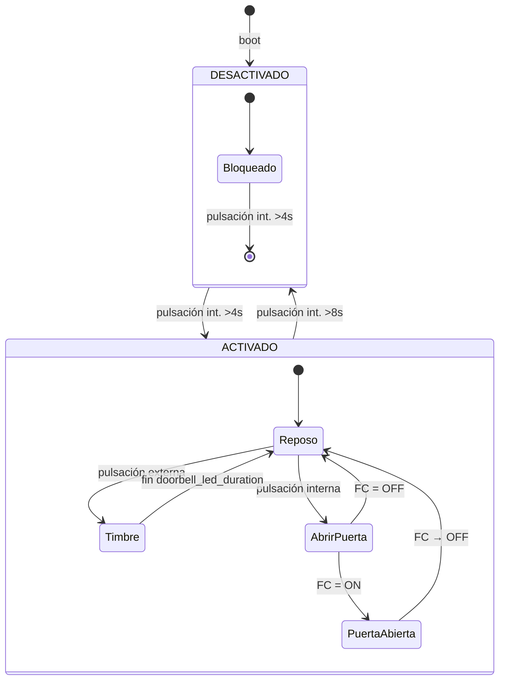

### 11.2 Diagrama general de conexiones (Vestíbulo)

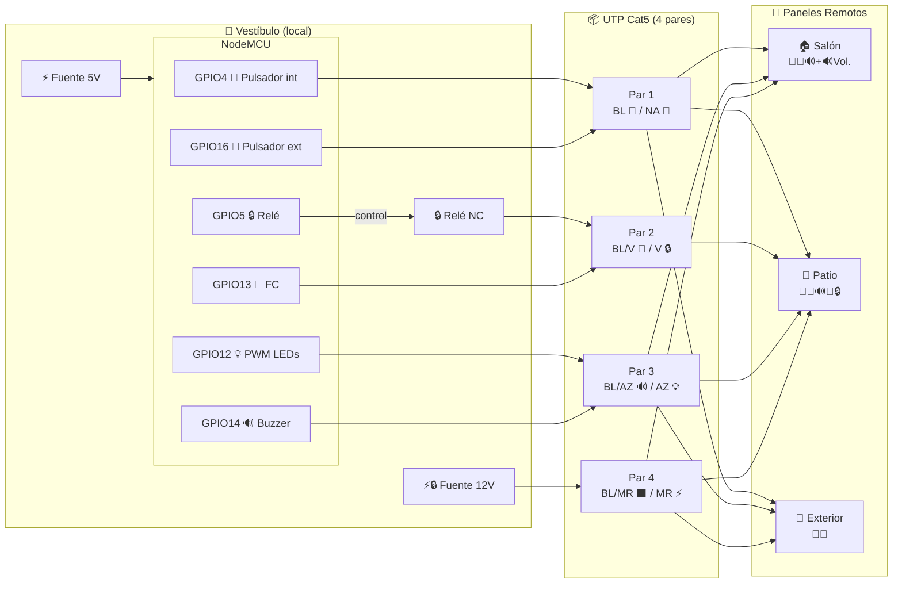

### 11.3 Circuito — Panel Interno (salón / vestíbulo)

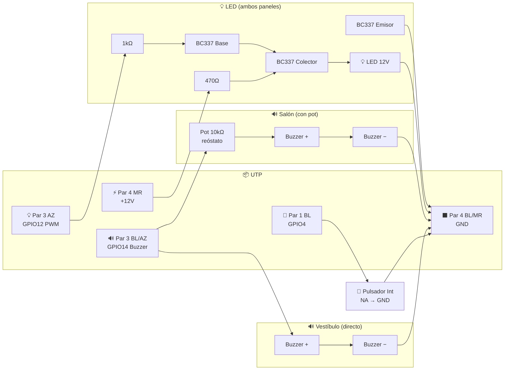

> **Panel de salón**: el buzzer lleva potenciómetro de 10kΩ en serie (reóstato) entre BL/AZ y el buzzer (+).
> **Panel de vestíbulo**: el buzzer se conecta directamente entre BL/AZ y GND (sin pot).
> Ambos paneles comparten el mismo circuito de LED (BC337 + 12V).

### 11.4 Circuito — Panel Externo (patio)

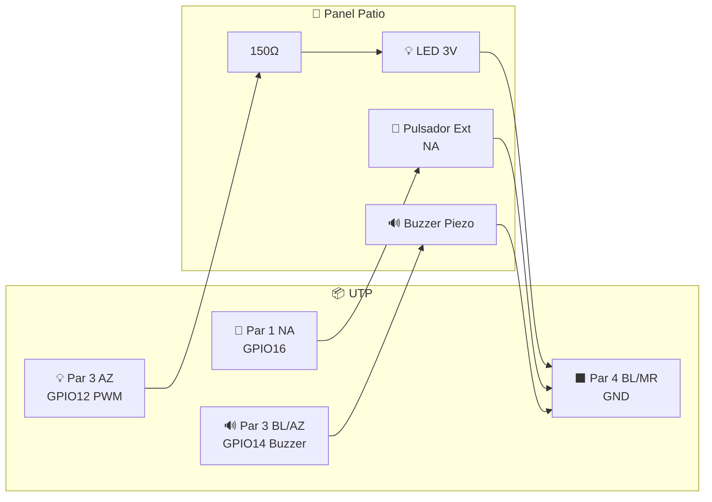

> El panel **exterior** es idéntico pero **sin el buzzer** — no conecta el hilo BL/AZ del par 3. Solo lleva pulsador (par 1 NA), LED (par 3 AZ) y alimentación (par 4).
> El pull-up de 10kΩ a 3.3V para GPIO16 está en el **vestíbulo**, junto al MCU.
### 11.5 Circuito — Cerradura + Pedal de Emergencia

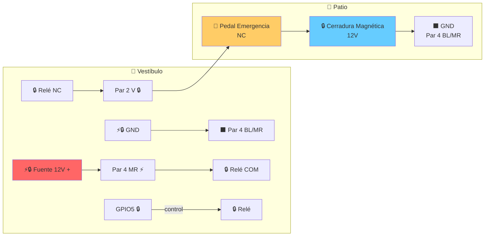

Flujo: `+12V → Par 4 MR → Relé COM → NC → Par 2 V → Pedal NC → Cerradura → GND`

| 🔒 Relé NC | 🚫 Pedal NC | 🔒 Cerradura |
|:----------:|:----------:|:------------:|
| Cerrado (OFF) | Cerrado | ⚡ 12V → puerta cerrada |
| Cerrado (OFF) | Abierto | ⬛ 0V → apertura emergencia |
| Abierto (ON) | — | ⬛ 0V → desbloqueo normal |

### 11.6 Pull-up de pulsador externo (GPIO16)

El pull-up de 10kΩ para GPIO16 está en el **vestíbulo**, junto al MCU. No en los paneles remotos.

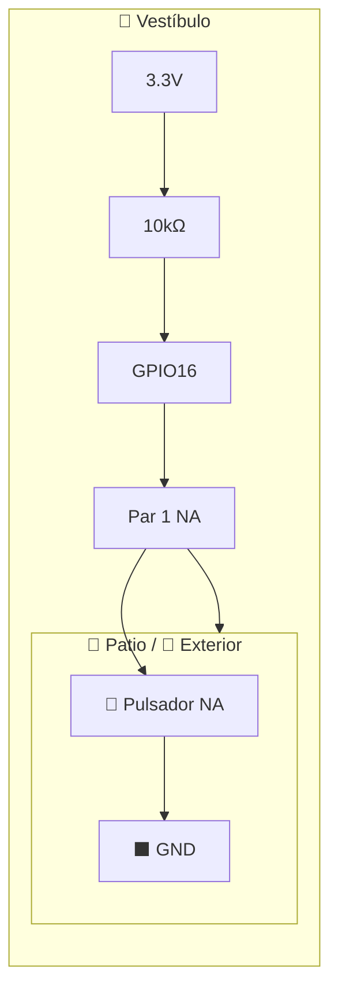

### 11.7 Swimlane — `external_press`

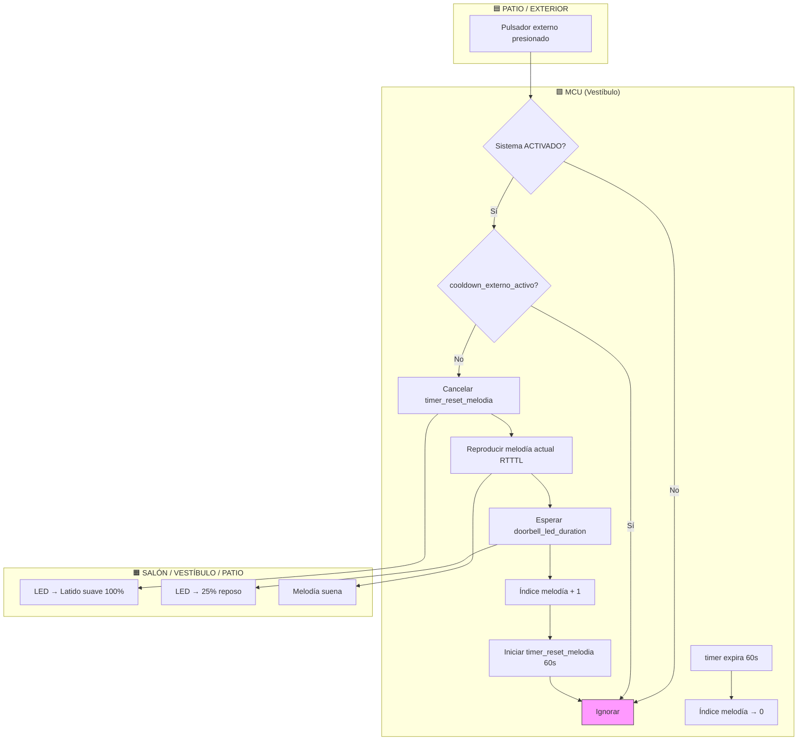

### 11.8 Swimlane — `internal_press`

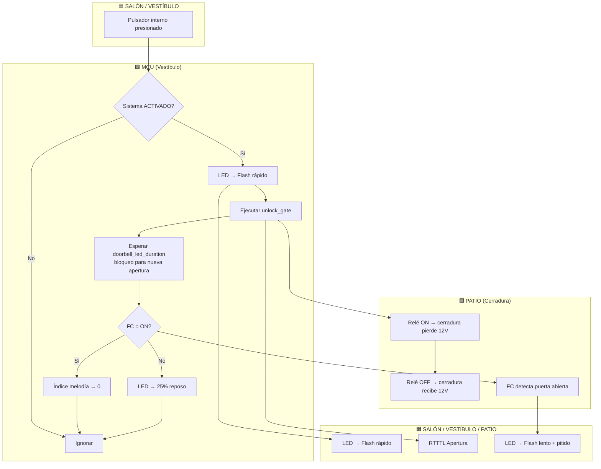

### 11.9 Swimlane — `unlock_gate`

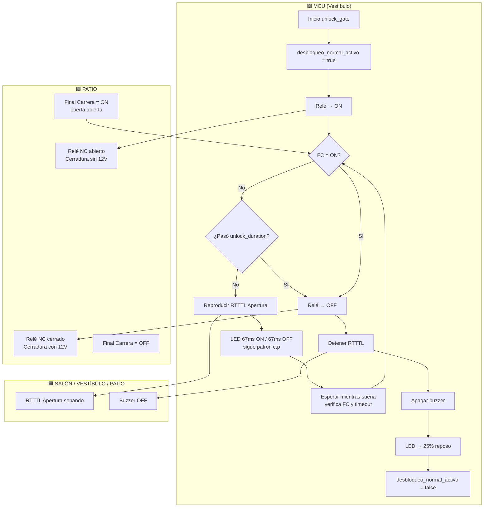

### 11.10 Swimlane — Detección de emergencia

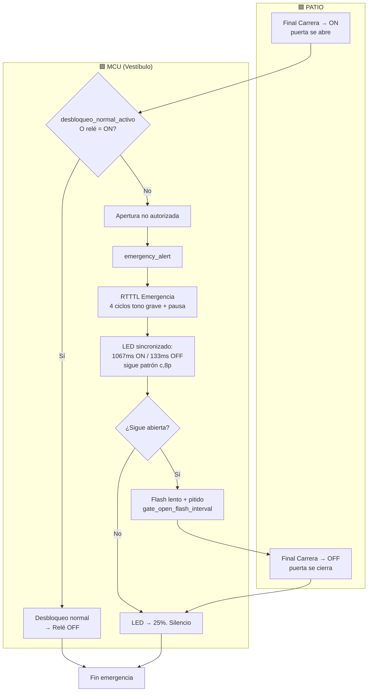

## 12. Archivos

```
esphome-gate/
├── SYSTEM_DEFINITION.md   # Especificación completa del sistema
├── esphome-gate.yaml      # Configuración ESPHome
├── melodies.h             # Definiciones RTTTL (referencia)
└── secrets.yaml           # Credenciales WiFi (editar antes de compilar)
```

## 13. Lista de Materiales

| # | Componente | Cant. | Especificación | Ubicación |
|---|-----------|:-----:|----------------|-----------|
| 1 | NodeMCU ESP8266 | 1 | ESP-12E, CP2102, microUSB | Vestíbulo |
| 2 | Fuente 5V | 1 | 5V DC, ≥1A, tipo cargador USB | Vestíbulo |
| 3 | Fuente 12V | 1 | 12V DC, ≥2A, tipo brick | Vestíbulo |
| 4 | Relé NC | 1 | Módulo relé 1 canal, 5V bobina, 10A/250V contacto | Vestíbulo |
| 5 | Cerradura Magnética | 1 | 12V, tipo ML-1501 o similar, ≤1.5A | Patio |
| 6 | Final de Carrera | 1 | NA (normalmente abierto), tipo microswitch con rodillo | Patio |
| 7 | Pedal de Emergencia | 1 | NC (normalmente cerrado), tipo pedal metálico o interruptor de pie | Patio |
| 8 | Buzzer piezoeléctrico | 3 | Zumbador piezo sin oscilador, 3–24V, tipo 2312 o similar | Salón / Vest. / Patio |
| 9 | Pulsador NA (interno) | 2 | Pulsador momentáneo NA, tipo campana o táctil | Salón / Vestíbulo |
| 10 | Pulsador NA (externo) | 2 | Pulsador momentáneo NA, tipo timbre estanco IP54 | Patio / Exterior |
| 11 | LED 5mm | 4 | Color a elección, 12V internos, 3.3V externos | 1 por panel |
| 12 | Transistor NPN BC337 | 2 | TO-92, 45V/800mA | Salón / Vestíbulo |
| 13 | Resistencia 1kΩ | 2 | 1/4W, carbon film | Salón / Vestíbulo (base BC337) |
| 14 | Resistencia 470Ω | 2 | 1/4W, carbon film | Salón / Vestíbulo (LED 12V colector) |
| 15 | Resistencia 150Ω | 2 | 1/4W, carbon film | Patio / Exterior (LED 3.3V serie) |
| 16 | Resistencia 10kΩ | 1 | 1/4W, carbon film | Vestíbulo (pull-up GPIO16) |
| 17 | Potenciómetro 10kΩ | 1 | Lineal, tipo reóstato, 6mm, ejey 15mm | Salón (volumen buzzer) |
| 18 | Cable UTP Cat5 | 1 | 4 pares, sólido, CCA o cobre, largo según distancia | Entre todas las zonas |
| 19 | Placa perforada / protoboard | 1 | 7×5 cm o similar | Vestíbulo (montaje MCU) |
| 20 | Cables dupont / manguera | — | Varios, 22AWG | Conexiones locales en cada panel |
